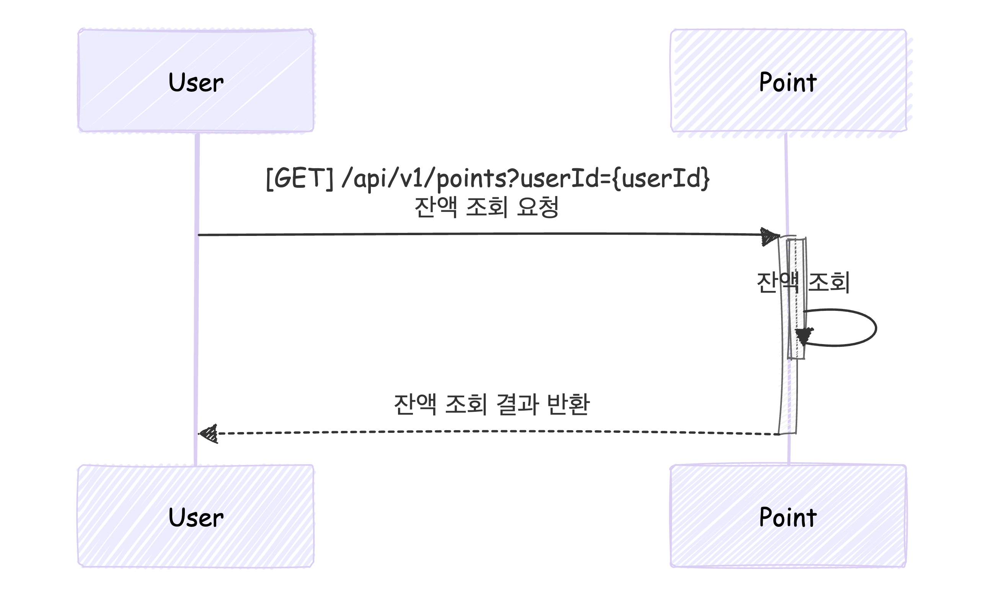
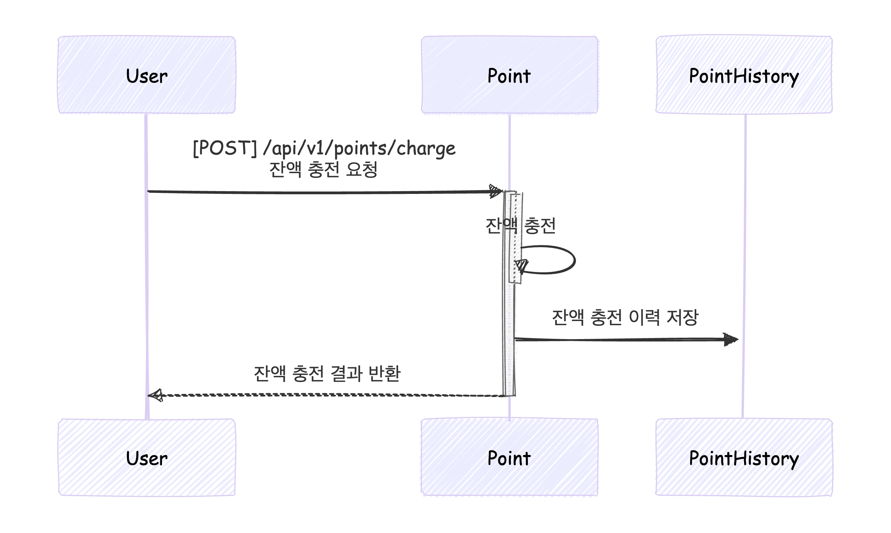
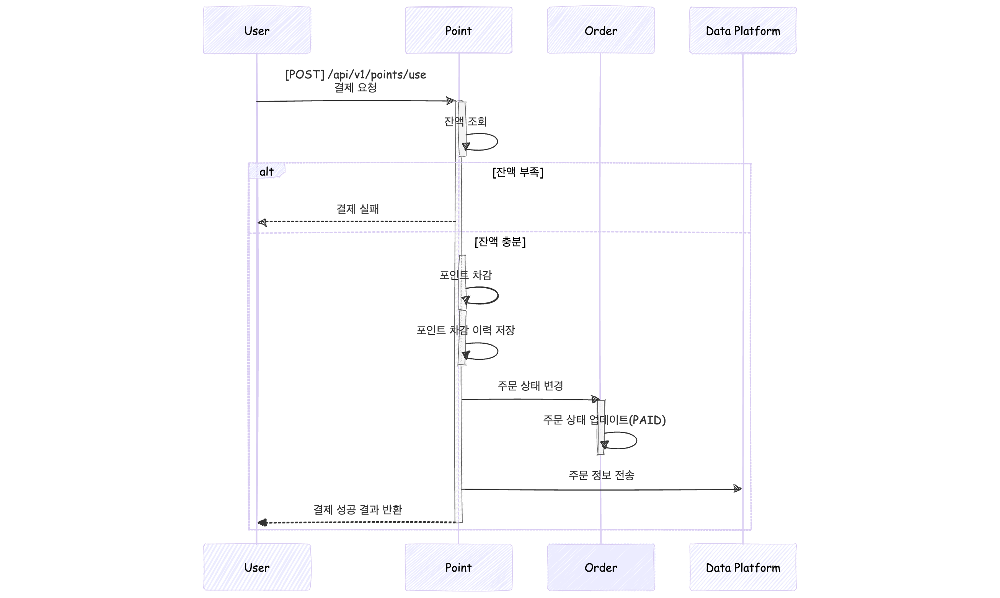
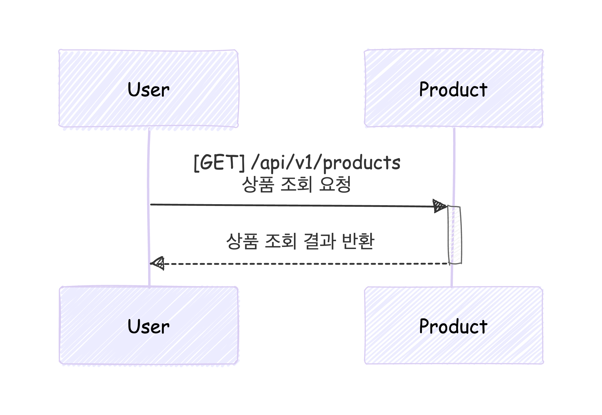
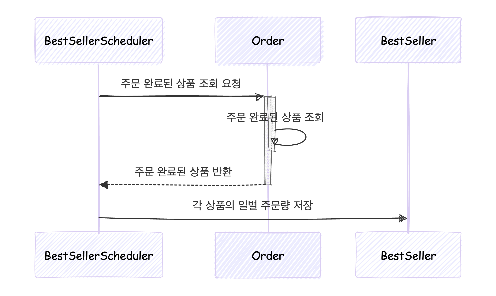
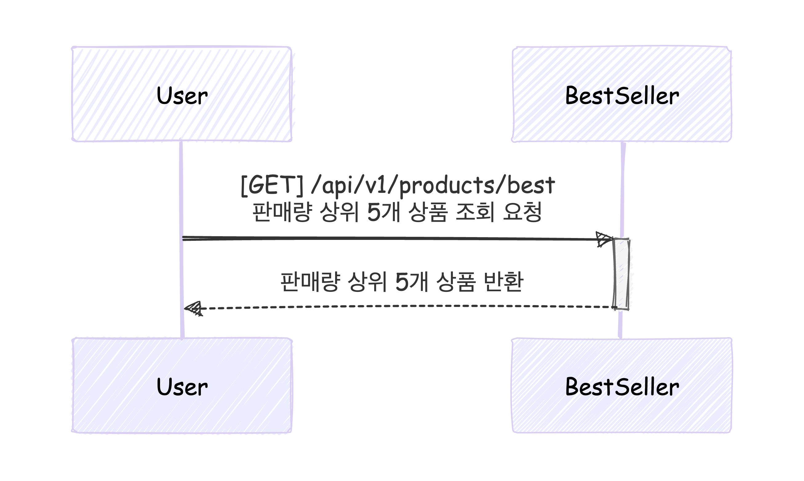
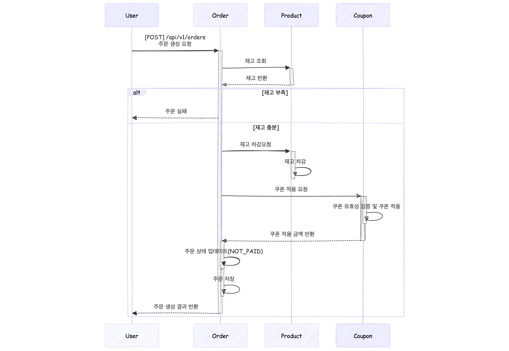
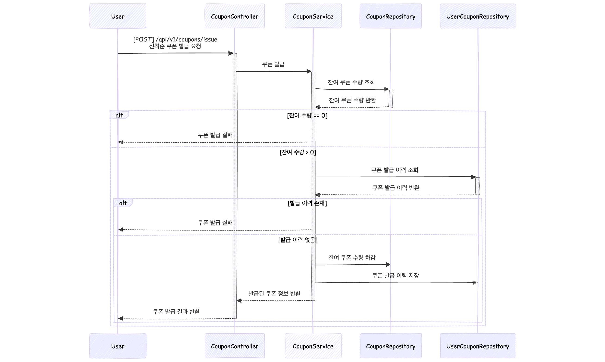
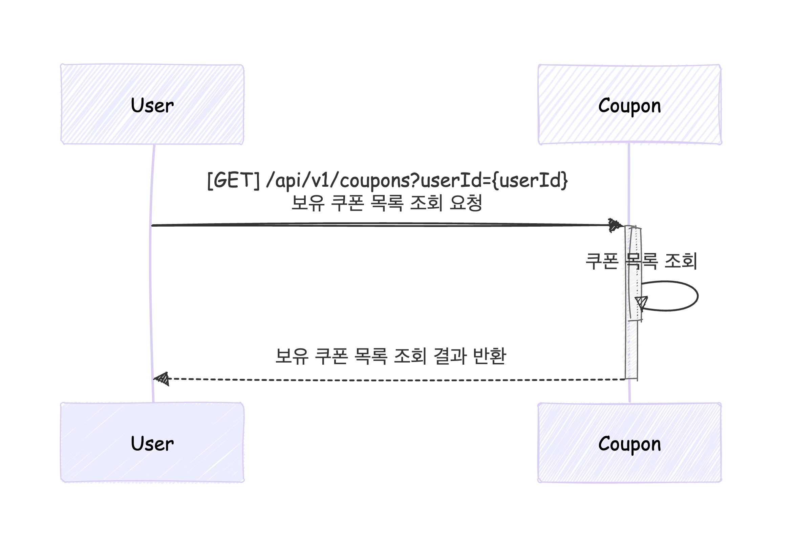
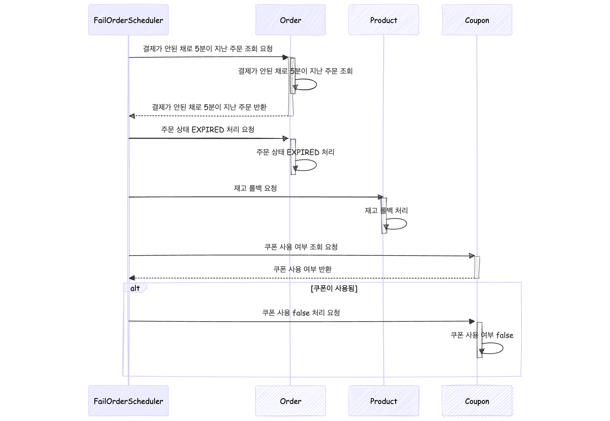

# Sequence Diagram

## Point

### 포인트 조회 시퀀스 다이어그램

### 포인트 충전 시퀀스 다이어그램

### 포인트 사용(결제) 시퀀스 다이어그램

## Product

### 상품 조회 시퀀스 다이어그램

### 최근 3일간 판매량이 제일 많은 순 인기 상품 5개 조회 시퀀스 다이어그램

## Order

### 주문 시퀀스 다이어그램

## Coupon

### 선착순 쿠폰 발급 시퀀스 다이어그램

### 쿠폰 조회 시퀀스 다이어그램

## 주문 완료 -> 결제 실패 시퀀스 다이어그램

