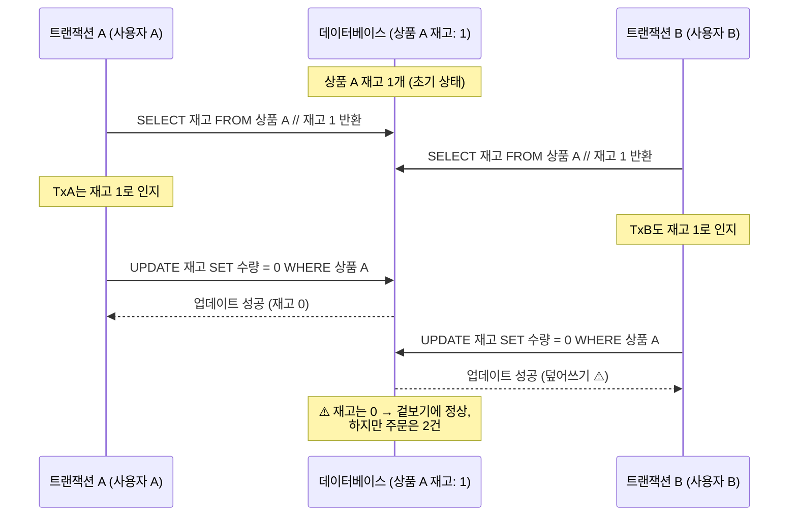
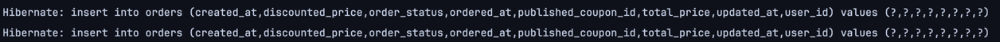
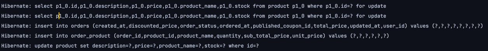
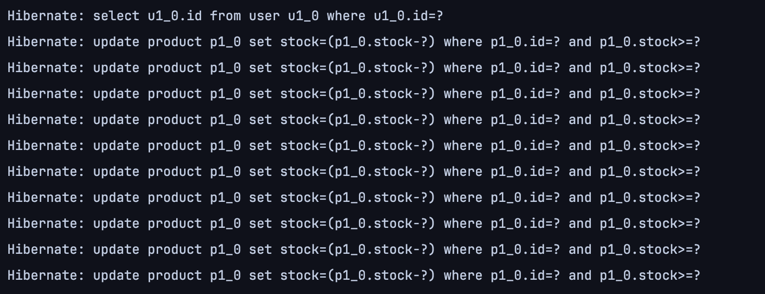
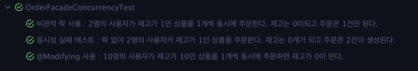
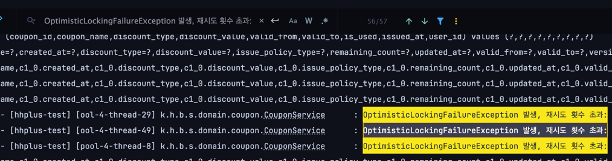
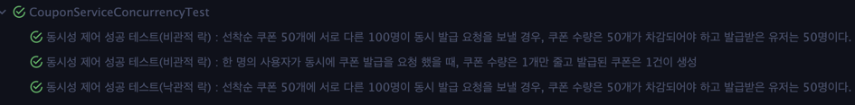
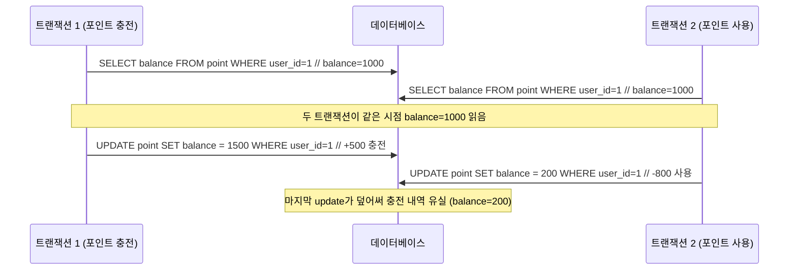

# 항해 플러스 이커머스 시스템 동시성 이슈 식별과 해결 문서

본 문서에서는 항해 플러스 이커머스에서 제공하는 기능에서 발생할 수 있는 동시성 문제를 식별하고, 발생 가능한 시나리오를  
살펴본 뒤에, 해결 방안을 제시합니다.

## 동시성 문제란?

동시성 문제는 여러 개의 작업이 동시에 실행되면서 공유된 자원에 접근할 때, 예상치 못한 잘못된 결과가 발생하거나  
시스템의 상태가 일관되지 않게 되는 문제들을 이야기합니다. 이러한 동시 접근이 발생했을 때 적절한 제어 방식이 부재하다면,  
작업 실행 순서가 예측 불가능하게 뒤섞이거나, 한 작업이 아직 완료되지 않은 불안정한 데이터를 다른 작업이 읽거나 수정하게 되어  
문제가 발생합니다. MySQL InnoDB 스토리지 엔진을 사용하는 환경에서 발생할 수 있는(Repeatable Read) 동시성 문제들은 다음과 같은 유형이 있습니다.

- 경쟁 상태
- 갱신 손실
- 교착 상태

여기서 경쟁 상태와 갱신 손실은 동일한 자원에 대해 두 개 이상의 트랜잭션이 동시에 접근하여 리소스를 수정하는 경우 발생하는 문제입니다.

교착 상태는 두 개 이상의 트랜잭션이 서로 상대방의 트랜잭션이 완료되기를 기다리면서 발생하는 문제입니다.

## 동시성 문제를 해결하는 대표적인 방법들(Spring Data JPA)

### 비관적 락(데이터베이스 수준의 Lock)

비관적 락은 데이터를 읽기 전에 해당 데이터에 락을 걸어 다른 트랜잭션이 데이터를 수정하는 것을 방지하는 동시성 제어 방식입니다.  
비관적이라는 이름은 데이터의 충돌이 발생할 가능성이 높다고 가정하고 미리 락을 걸어버려서 문제를 예방하는 방식이기 때문입니다.  
비관적 락은 아래와 같은 순서대로 동작합니다.

1. 트랜잭션이 특정 데이터를 조회하면서 비관적 락을 요청합니다. Spring Data JPA에서는 `@Lock(LockModeType.PESSIMISTIC_WRITE)`이나  
   `@Lock(LockModeType.PESSIMISTIC_READ)` 어노테이션을 사용합니다.
2. 어떤 자원을 증가하거나 감소하려는 경우 배타락을 걸어야 하고 데이터를 읽는 동안 다른 데이터의 수정을 방지하기 위해서는 공유락을 겁니다.
3. 락을 획득한 트랜잭션은 안전하게 데이터를 읽고 수정할 수 있습니다.
4. 트랜잭션이 커밋 혹은 롤백을 수행하면 락은 자동으로 해제됩니다.
5. 다른 트랜잭션은 락이 해제될 때까지 대기합니다.

### 낙관적 락(애플리케이션 수준의 락)

낙관적 락은 데이터 충돌이 자주 발생하지 않을 것이라고 가정하고, 데이터를 실제로 업데이트하기 전에 충돌 여부를 확인하는  
동시성 제어 방식입니다. "낙관적"이라는 의미는 데이터 충돌이 발생하지 않을 것이라고 가정하고 먼저 작업을 진행한 후, 업데이트하는  
시점에 충돌을 확인하는 방식으로 동작하는 것에서 온 것입니다. 낙관적 락은 아래와 같은 순서로 동작합니다.

1. 테이블에 데이터의 버전을 관리하는 컬럼(`@Version`)을 추가합니다.
2. 트랜잭션이 데이터를 읽을 때, 해당 데이터의 버전 값도 함께 읽어 옵니다.
3. 데이터를 수정하고 업데이트 쿼리를 실행할 때 WHERE 절에 버전을 포함시킵니다.
4. 업데이트 쿼리가 성공적으로 실행된다면, 버전 값이 일치하므로 충돌이 없었던 것으로 간주하고 버전을 1 증가시킵니다.
5. 업데이트된 행의 개수가 0이면, 이미 다른 트랜잭션이 해당 데이터를 수정하고 버전을 증가시켰기 때문에 WHERE 절의 버전 조건이 맞지 않아 업데이트가 실패한 경우, 즉 충돌 발생을 의미합니다.
6. 충돌이 감지되면 `OptimisticLockingFailureException` 예외가 발생합니다. 이 예외를 처리하여 적절한 조치를 취할 수 있습니다.(재시도 혹은 사용자에게 알림 등)

### @Modifying

`@Modifying` 어노테이션은 Spring Data JPA에서 제공하는 기능으로, 데이터베이스에 대한 수정 작업을 수행하는 쿼리를 정의할 때 사용됩니다.  
이 어노테이션을 사용하면 데이터를 변경하는 쿼리임을 명시할 수 있습니다. 이 방식은 락을 활성화하거나 제어하지 않습니다. 하지만 데이터 변경 작업 시  
데이터를 읽고 변경하고 다시 쓰는 과정을 트랜잭션 내부에서 원자적으로 처리할 수 있기 때문에 락을 필요로 하지 않습니다.

## 동시성 문제 발생 시나리오 1. 재고 수량 감소 및 증가

재고 수량은 주문, 반품, 환불 등 다양한 상황에서 변경될 수 있습니다. 현재 항해 플러스 이커머스 프로젝트에서는 사용자가  
주문을 했을때 감소하고, 주문 생성 후 5분 이내에 결제가 되지 않으면 주문이 취소되고 재고 수량이 증가하는 스케줄러 로직이 있습니다.
현재 재고라는 공유 자원에 접근하는 시나리오는 아래와 같은 경우가 발생할 수 있습니다.

서로 다른 사용자가 재고가 1인 상품을 1개씩 동시 주문하는 경우



현재 상품 도메인 로직에서는 재고가 음수로 내려가는 것은 방어되고 있습니다.
하지만 다이어그램에서 볼 수 있듯이 재고가 충분하지 않은 상황에서도 주문이 정상적으로 생성되거나,
동시에 접근한 다른 트랜잭션이 한 트랜잭션의 재고 차감 결과를 덮어써 버리는 갱신 손실(Lost Update) 문제가 발생할 수 있습니다.
이로 인해 재고는 0으로 유지되지만, 주문은 2건 이상 생성되어 오버셀링이 발생할 수 있습니다.

### 그렇다면 재고 차감에서는 어떤 방법을 써서 처리해야할까?

현재 항해 플러스 이커머스에서는 공유된 자원에 대한 읽기-갱신-저장 연산을 안전하게 수행하기 위해서 JPA의 낙관적 락과 비관적 락을 사용할 수 있습니다.  
비관적 락과 낙관적 락 중 어떤 것을 사용하느냐의 **가장 중요한 기준점은 '충돌 가능성'의 높고 낮음입니다.** 재고는 어떨까요? 상품 재고는 상품별로 여러 사용자의  
주문이 동시에 발생할 수 있습니다. 인기 상품의 경우는 더 많은 동시 요청이 발생합니다. 그러므로 재고 차감은 충돌 가능성이 높습니다.  
따라서 비관적 락을 사용하여 재고를 차감하는 것이 적절한 방식입니다.

현재 주문은 OrderFacade#createOrder() 메서드에서 주문을 생성하는데 이 과정에서 재고 차감 로직이 수행되고 있습니다.

### 기존 코드

```java

@Transactional
public OrderCreateResult createOrderV1(OrderCreateCommand command) {

	User findUser = userService.getUserById(command.userId());

	// 우선 주문 도메인 객체를 생성해
	Order order = Order.create(findUser);

	// 그리고 상품 재고를 차감하고 주문 상품을 추가해
	command.orderLines().forEach(line -> {
		Product product = productService.decreaseStockLockFree(line.productId(), line.quantity()); // V1은 LockFree
		order.addOrderProduct(product, line.quantity());
	});

	// 적용할 쿠폰이 있어?
	if (command.publishedCouponId() != null) {
		PublishedCoupon findPublishedCoupon = couponService.getPublishedCouponById(command.publishedCouponId());

		order.applyCoupon(findPublishedCoupon);
	}

	return OrderCreateResult.from(orderService.order(order));
}

@Transactional
public Product decreaseStockLockFree(Long productId, Long quantity) {
	Product product = productRepository.findById(productId);
	product.decreaseStock(quantity);

	return productRepository.save(product);
}
```

위의 코드에서는 제품을 조회해오는 시점에 락을 걸어주지 않고 있고, 2명의 사용자가 재고가 1인 상품을 주문하면 재고는 재고가 0이 되고 주문은 1건이 생성되어야 합니다.  
재고가 1개 밖에 남지 않았으니 사용자 둘 중 한 명의 주문은 실패할 것이기 때문입니다.

### 테스트 코드 : 실패 케이스

```java

@Test
@DisplayName("동시성 실패 테스트 : 락 없이 2명의 사용자가 재고가 1인 상품을 주문한다. 재고는 0개가 되고 주문은 2건이 생성된다.")
void concurrentOrderFailTest() throws InterruptedException {
	// given
	User user1 = Instancio.of(User.class)
		.ignore(field("id"))
		.create();
	User user2 = Instancio.of(User.class)
		.ignore(field("id"))
		.create();
	User savedUser1 = userJpaRepository.save(user1);
	User savedUser2 = userJpaRepository.save(user2);

	Product product = Instancio.of(Product.class)
		.ignore(field("id"))
		.set(field(Product.class, "stock"), 1L)
		.create();

	Product savedProduct = productJpaRepository.save(product);

	int threadCount = 2;

	ExecutorService es = Executors.newFixedThreadPool(threadCount);
	CountDownLatch countDownLatch = new CountDownLatch(threadCount);

	// when
	es.submit(() -> {
		try {
			OrderCreateCommand command = new OrderCreateCommand(
				savedUser1.getId(),
				null,
				List.of(new OrderLine(savedProduct.getId(), 1L))
			);
			orderFacade.createOrderV1(command);
		} catch (Exception e) {
			// 예외 무시
		} finally {
			countDownLatch.countDown();
		}
	});

	es.submit(() -> {
		try {
			OrderCreateCommand command = new OrderCreateCommand(
				savedUser2.getId(),
				null,
				List.of(new OrderLine(savedProduct.getId(), 1L))
			);
			orderFacade.createOrderV1(command);
		} catch (Exception e) {
			// 예외 무시
		} finally {
			countDownLatch.countDown();
		}
	});

	countDownLatch.await();
	es.shutdown();

	// then
	Product findProduct = productJpaRepository.findById(savedProduct.getId()).orElseThrow();
	assertAll(
		() -> assertThat(findProduct.getStock()).isEqualTo(0L),
		() -> assertThat(orderJpaRepository.findAll()).hasSize(2) // 1건이 생성되어야 하는데 주문 2건 생성
	);
}
```



재고는 현재 재고 차감 로직에서 음수를 방어하는 도메인 로직이 있어 재고가 음수가 되진 않았지만 쿼리를 보면 주문은 2건이 생성되었습니다.  
그래서 다음과 같이 비관적 락을 사용하여 재고를 차감하는 로직으로 변경했습니다.

### 비관적 락을 사용한 재고 차감 로직

```java
public interface ProductJpaRepository extends JpaRepository<Product, Long>, ProductJpaRepositoryCustom {

	@Lock(LockModeType.PESSIMISTIC_WRITE)
	@Query("SELECT p FROM Product p WHERE p.id = :productId")
	Optional<Product> findByIdPessimistic(@Param("productId") Long productId);

}

@Transactional
public Product decreaseStockWithPessimistic(Long productId, Long quantity) {
	Product product = productRepository.findByIdPessimistic(productId);
	product.decreaseStock(quantity);

	return productRepository.save(product);
}
```

```java
// OrderFacade#createOrderV2 내부 재고 차감 로직 변경
@Transactional
public OrderCreateResult createOrderV2(OrderCreateCommand command) {

	// .....
	command.orderLines().forEach(line -> {
		// 비관락 
		Product product = productService.decreaseStockWithPessimistic(line.productId(), line.quantity());
		order.addOrderProduct(product, line.quantity());
	});
}
```

그리고 아래와 같은 테스트 코드를 실행시켰습니다.

```java

@Test
@DisplayName("비관적 락 사용 : 2명의 사용자가 재고가 1인 상품을 1개씩 동시에 주문한다. 재고는 0이되고 주문은 1건만 된다.")
void concurrentOrderTestWithPessimistic() throws InterruptedException {
	// given
	User user1 = Instancio.of(User.class)
		.ignore(field("id"))
		.create();
	User user2 = Instancio.of(User.class)
		.ignore(field("id"))
		.create();
	User savedUser1 = userJpaRepository.save(user1);
	User savedUser2 = userJpaRepository.save(user2);

	Product product = Instancio.of(Product.class)
		.ignore(field("id"))
		.set(field(Product.class, "stock"), 1L)
		.create();

	Product savedProduct = productJpaRepository.save(product);

	int threadCount = 2;

	ExecutorService es = Executors.newFixedThreadPool(threadCount);
	CountDownLatch countDownLatch = new CountDownLatch(threadCount);

	// when
	es.submit(() -> {
		try {
			OrderCreateCommand command = new OrderCreateCommand(
				savedUser1.getId(),
				null,
				List.of(new OrderLine(savedProduct.getId(), 1L))
			);
			orderFacade.createOrderV2(command);
		} catch (Exception e) {
			// 예외 무시
		} finally {
			countDownLatch.countDown();
		}
	});

	es.submit(() -> {
		try {
			OrderCreateCommand command = new OrderCreateCommand(
				savedUser2.getId(),
				null,
				List.of(new OrderLine(savedProduct.getId(), 1L))
			);
			orderFacade.createOrderV2(command);
		} catch (Exception e) {
			// 예외 무시
		} finally {
			countDownLatch.countDown();
		}
	});

	countDownLatch.await();
	es.shutdown();

	// then
	Product findProduct = productJpaRepository.findById(savedProduct.getId()).orElseThrow();
	assertAll(
		() -> assertThat(findProduct.getStock()).isEqualTo(0L),
		() -> assertThat(orderJpaRepository.findAll()).hasSize(1) // 1건이 생성되어야 한다.
	);
}
```



수행된 쿼리를 보면 `for update`가 붙어있는 것을 확인할 수 있습니다. 그리고 주문은 1건만 생성되었습니다. 재고 차감 역시  
음수가 될 경우 예외를 발생시키고 있기 때문에 재고 차감은 1건만 성공적으로 이루어졌습니다.

다음은 `@Modifying` 어노테이션을 사용해서 처리하고 시나리오는 10명의 사용자가 재고가 1인 상품을 1개씩 동시에 주문하는 시나리오입니다.  
상품 재고 차감의 원자적 연산을 보장하기 위해 아래와 같은 코드를 작성하고 테스트 코드를 실행했습니다.

### @Modifying 어노테이션을 사용한 재고 차감 로직

```java

@Transactional
public OrderCreateResult createOrderV3(OrderCreateCommand command) {
	// ....
	command.orderLines().forEach(line -> {
		Product product = productService.decreaseStockWithModifying(line.productId(), line.quantity());
		order.addOrderProduct(product, line.quantity());
	});

	// ...
	return OrderCreateResult.from(orderService.order(order));
}

@Transactional
public Product decreaseStockWithModifying(Long productId, Long quantity) {
	int updatedRow = productRepository.decreaseStock(productId, quantity);

	if (updatedRow == 0) {
		Product product = productRepository.findById(productId);
		throw new ProductOutOfStockException(product.getStock(), quantity);
	}

	return productRepository.findById(productId);
}

@Modifying(clearAutomatically = true, flushAutomatically = true)
@Query("""
	  UPDATE Product p
	     SET p.stock = p.stock - :quantity
	   WHERE p.id = :productId
	     AND p.stock >= :quantity
	""")
int decreaseStock(@Param("productId") Long productId, @Param("quantity") Long quantity);
```

```java

@Test
@DisplayName("@Modifying 사용 : 10명의 사용자가 재고가 10인 상품을 1개씩 동시에 주문하면 재고가 0이 된다.")
void concurrentOrderWithModifyingForTenUsers() throws InterruptedException {
	// given
	List<User> users = IntStream.rangeClosed(1, 10)
		.mapToObj(i -> Instancio.of(User.class)
			.ignore(field("id"))
			.create())
		.toList();
	List<User> savedUsers = userJpaRepository.saveAll(users);

	Product product = Instancio.of(Product.class)
		.ignore(field("id"))
		.set(field(Product.class, "stock"), 10L)
		.create();
	Product savedProduct = productJpaRepository.save(product);

	int threadCount = 10;

	ExecutorService es = Executors.newFixedThreadPool(threadCount);
	CountDownLatch ready = new CountDownLatch(threadCount);
	CountDownLatch start = new CountDownLatch(1);

	// when
	for (User user : savedUsers) {
		es.submit(() -> {
			ready.countDown();
			try {
				start.await();
				OrderCreateCommand command = new OrderCreateCommand(
					user.getId(),
					null,
					List.of(new OrderLine(savedProduct.getId(), 1L))
				);
				orderFacade.createOrderV3(command);
			} catch (Exception e) {
				// 예외 발생해도 무시
			}
		});
	}

	ready.await();
	start.countDown();
	es.shutdown();
	es.awaitTermination(2, TimeUnit.SECONDS);

	// then
	Product findProduct = productJpaRepository.findById(savedProduct.getId()).orElseThrow();
	assertAll(
		() -> assertThat(findProduct.getStock()).isEqualTo(0L),
		() -> assertThat(orderJpaRepository.findAll()).hasSize(10) // 10건이 생성되어야 한다.
	);
}
```



그 결과 재고는 0건이 되었고 주문은 10건이 생성되었습니다. 또한 `@Modifying` 어노테이션을 사용하여 재고 차감 쿼리를 작성했기 때문에 `for update`가 붙지 않았습니다.  
이렇게 `@Modifying` 어노테이션을 사용하면 원자적으로 연산을 처리할 수 있기 때문에 락을 사용하지 않고도 동시성 문제를 해결할 수 있습니다.  
하지만 반환값이 변경이 발생한 행의 개수(Integer)를 반환하기 때문에 이후의 로직에서 엔티티를 사용하고자 한다면 다시 조회를 해야한다는 문제점이 있습니다.  
영속성 컨텍스트 불일치 위험때문에 매 번 영속성 컨텍스트를 깔끔하게 유지해줘야 한다는 관리 포인트가 생깁니다. 따라서 `@Modifying` 어노테이션은  
주로 단순한 쿼리에서 사용하고, 복잡한 비즈니스 로직에서는 비관적 락을 사용하는 것이 좋습니다.

### 전체 테스트 결과



### 결론

충돌 가능성이 높은 공유 자원의 경우 비관적 락을 사용하여 동시성 문제를 해결하는 것이 적절합니다. 따라서 재고의 경우 상품별로 여러 사용자의  
주문 요청이 들어올 수 있기 때문에 충돌 가능성이 높다고 판단할 수 있고 비관적 락을 사용하는 것이 적합합니다. 만약 단순히 재고 차감만 수행하는 경우엔  
`@Modifying` 어노테이션을 사용하여 원자적 연산을 수행하는 방법을 고려해볼 수 있습니다. 반면, 충돌 가능성이 적은 경우엔 낙관적 락을 사용하여  
동시성 문제를 해결하는 것이 좋습니다. 앞으로 소개할 시나리오에서도 이와 같은 논리대로 적절한 락 전략을 채택할 것입니다.

## 동시성 문제 발생 시나리오 2. 선착순 쿠폰 발급

현재 우리의 시스템에서는 선착순 쿠폰 발급을 요청하는 API가 있습니다. 쿠폰에는 수량이 정해져있는 선착순 쿠폰과 수량 필드가 null인 무제한 발급 쿠폰이 있습니다.  
쿠폰 역시 인기 상품과 마찬가지로 여러 사용자가 동시에 요청할 수 있는 자원입니다. 쿠폰이 초과 발급이 되면 안되는, 즉 수량이라는 공유 자원이 정확하게 지켜져야 합니다.  
따라서 쿠폰에서는 비관적 락을 사용하여 동시성 문제를 해결할 것입니다.

기존에는 다음과 같이 작성했습니다.

### 기존 소스 코드

```java

@Transactional
public void issueCoupon(CouponIssueCommand command) {
	if (couponRepository.existsPublishedCouponBy(command.userId(), command.couponId())) {
		throw new CouponAlreadyIssuedException();
	}

	Coupon coupon = couponRepository.findById(command.couponId());
	coupon.issue();

	Coupon savedCoupon = couponRepository.save(coupon);

	PublishedCoupon publishedCoupon = PublishedCoupon.create(command.userId(), savedCoupon, LocalDate.now());
	couponRepository.savePublishedCoupon(publishedCoupon);
}
```

위의 코드에서는 쿠폰 발급을 요청할 때, 먼저 사용자가 이미 발급받은 쿠폰인지 확인하고, 쿠폰을 발급한 후에 발급된 쿠폰을 저장하는 로직입니다.
N명의 사용자의 동시 요청이 들어오게 되면, 락이 걸리지 않기 때문에 Race Condition에 의해 데이터 정합성이 깨지게 되거나 갱신 분실 문제가 발생합니다.  
뿐만 아니라, 한 명의 사용자가 동시 요청을 하게 되면 `couponRepository.existsPublishedCouponBy(command.userId(), command.couponId()`에서 두 요청이
`false`를 반환하게 되어 중복 발급이 발생할 수 있습니다.

따라서 아래와 같이 비관적 락을 사용하여 쿠폰 발급 로직을 변경했습니다.

### 비관적 락을 사용한 쿠폰 발급 로직

```java

@Transactional
public void issueCouponV2(CouponIssueCommand command) {

	Coupon coupon = couponRepository.findByIdWithPessimistic(command.couponId());

	if (couponRepository.existsPublishedCouponBy(command.userId(), command.couponId())) {
		throw new CouponAlreadyIssuedException();
	}

	coupon.issue();

	Coupon savedCoupon = couponRepository.save(coupon);

	PublishedCoupon publishedCoupon = PublishedCoupon.create(command.userId(), savedCoupon, LocalDate.now());
	couponRepository.savePublishedCoupon(publishedCoupon);
}

public interface CouponJpaRepository extends JpaRepository<Coupon, Long> {

	@Lock(value = LockModeType.PESSIMISTIC_WRITE)
	@Query("SELECT c FROM Coupon c WHERE c.id = :couponId")
	Optional<Coupon> findByIdWithPessimistic(@Param("couponId") Long couponId);

}
```

위의 코드에서는 쿠폰을 조회할 때 비관적 락을 사용하여 다른 트랜잭션이 해당 쿠폰을 수정하지 못하도록 락을 걸어줍니다. 이 덕분에 쿠폰의 중복 발급 여부 역시  
락의 범위 안에 있기 때문에 같은 사용자의 동시 요청이 들어와도 중복 발급을 막을 수 있습니다. 테스트 코드는 아래와 같이 두 개의 시나리오대로 작성했고, 모두 통과했습니다.

### 테스트 코드 : 동시성 제어 성공 테스트(비관적 락)

```java

@Test
@DisplayName("동시성 제어 성공 테스트(비관적 락) : 한 명의 사용자가 동시에 쿠폰 발급을 요청 했을 때, 쿠폰 수량은 1개만 줄고 발급된 쿠폰은 1건이 생성")
void couponConcurrencyTestWithPessimistic() throws InterruptedException {
	// given
	Coupon coupon = Instancio.of(Coupon.class)
		.ignore(field(Coupon.class, "id"))
		.set(field(Coupon.class, "issuePolicyType"), CouponIssuePolicyType.LIMITED)
		.set(field(Coupon.class, "remainingCount"), 1L)
		.create();
	coupon = couponJpaRepository.save(coupon);

	long userId = 123L;
	CouponIssueCommand command = new CouponIssueCommand(userId, coupon.getId());

	// when
	ExecutorService exec = Executors.newFixedThreadPool(2);
	CountDownLatch ready = new CountDownLatch(2);
	CountDownLatch start = new CountDownLatch(1);

	Runnable task = () -> {
		ready.countDown();
		try {
			start.await();
			couponService.issueCouponV2(command);
		} catch (Exception ignored) {
		}
	};
	exec.submit(task);
	exec.submit(task);
	ready.await();
	start.countDown();
	exec.shutdown();
	exec.awaitTermination(1, TimeUnit.SECONDS);

	// then
	Coupon afterIssuedCoupon = couponJpaRepository.findById(coupon.getId()).orElseThrow();

	assertAll(
		() -> assertThat(afterIssuedCoupon.getRemainingCount()).isEqualTo(0L)
			.as("재고는 한 개가 차감되었다."),
		() -> assertThat(publishedCouponJpaRepository.findAll())
			.as("발급된 쿠폰 건수는 1개이다.")
	);
}

@Test
@DisplayName("동시성 제어 성공 테스트(비관적락) : 선착순 쿠폰 50개에 서로 다른 100명이 동시 발급 요청을 보낼 경우, 쿠폰 수량은 50개가 차감되어야 하고 발급받은 유저는 50명이다.")
void couponConcurrencySuccessTestWithLimited() throws InterruptedException {
	// given
	Coupon coupon = Instancio.of(Coupon.class)
		.ignore(field(Coupon.class, "id"))
		.set(field(Coupon.class, "issuePolicyType"), CouponIssuePolicyType.LIMITED)
		.set(field(Coupon.class, "remainingCount"), 50L)
		.create();
	coupon = couponJpaRepository.save(coupon);
	Long couponId = coupon.getId();

	int totalUsers = 100;

	ExecutorService exec = Executors.newFixedThreadPool(totalUsers);
	CountDownLatch ready = new CountDownLatch(totalUsers);
	CountDownLatch start = new CountDownLatch(1);

	for (int i = 0; i < totalUsers; i++) {
		final long userId = i + 1L;
		exec.submit(() -> {
			ready.countDown();
			try {
				start.await();
				CouponIssueCommand command = new CouponIssueCommand(userId, couponId);
				couponService.issueCouponV2(command);
			} catch (Exception ignored) {
			}
		});
	}

	ready.await();   // 모든 스레드가 준비될 때까지 대기
	start.countDown(); // 동시에 시작
	exec.shutdown();
	exec.awaitTermination(1, TimeUnit.SECONDS);

	// then
	Coupon after = couponJpaRepository.findById(coupon.getId()).orElseThrow();
	List<PublishedCoupon> allIssued = publishedCouponJpaRepository.findAll();

	assertAll(
		() -> assertThat(after.getRemainingCount()).isEqualTo(0L)
			.as("쿠폰 수량이 정확히 50개 차감된다."),
		() -> assertThat(allIssued.size()).isEqualTo(50)
			.as("총 50명의 사용자만 발급받았다.")
	);
}
```

### 낙관적 락을 사용한 쿠폰 발급 로직

100명의 사용자가 수량이 50개 남아있는 쿠폰 발급을 동시에 요청한 시나리오에 동일하게 낙관적 락을 사용하고 이를 테스트 했습니다.  
쿠폰 엔티티에 `@Version` 어노테이션을 달아준 version 필드를 추가하고 아래와 같이 충돌 시 재시도를 수행하도록 했습니다.

```java

@Retryable(
	value = {OptimisticLockingFailureException.class},
	maxAttempts = 3,
	backoff = @Backoff(delay = 200, multiplier = 2)
)
@Transactional
public void issueCouponV3(CouponIssueCommand command) {

	Coupon coupon = couponRepository.findByIdWithOptimistic(command.couponId());

	if (couponRepository.existsPublishedCouponBy(command.userId(), command.couponId())) {
		throw new CouponAlreadyIssuedException();
	}

	coupon.issue();

	Coupon savedCoupon = couponRepository.save(coupon);

	PublishedCoupon publishedCoupon = PublishedCoupon.create(command.userId(), savedCoupon, LocalDate.now());
	couponRepository.savePublishedCoupon(publishedCoupon);
}

@Recover
public void recover(OptimisticLockingFailureException e, CouponIssueCommand command) {
	log.info("OptimisticLockingFailureException 발생, 재시도 횟수 초과: {}", e.getMessage());
	throw e;
}

public interface CouponJpaRepository extends JpaRepository<Coupon, Long> {

	@Lock(value = LockModeType.OPTIMISTIC)
	@Query("SELECT c FROM Coupon c WHERE c.id = :couponId")
	Optional<Coupon> findByIdWithOptimistic(@Param("couponId") Long couponId);
}

```

낙관적 락을 적용한 방식에서는 충돌이 발생했을 때 재시도를 최대 3번까지 하는 전략을 취했습니다. 그리고 재시도 간격은 200ms부터 시작해서 2배씩 늘려나갔습니다.  
최대 재시도 횟수 안에서도 쿠폰을 발급받지 못한 경우엔 로그 메세지를 남기도록 했습니다. 그리고 동일한 시나리오에서 테스트를 진행했습니다.

### 테스트 코드 : 동시성 제어 성공 테스트(낙관적 락)

```java

@Test
@DisplayName("동시성 제어 성공 테스트(낙관적 락) : 선착순 쿠폰 50개에 서로 다른 100명이 동시 발급 요청을 보낼 경우, 쿠폰 수량은 50개가 차감되어야 하고 발급받은 유저는 50명이다.")
void couponConcurrencyTestOptimistic() throws InterruptedException {
	// given
	Coupon coupon = Instancio.of(Coupon.class)
		.ignore(field(Coupon.class, "id"))
		.set(field(Coupon.class, "issuePolicyType"), CouponIssuePolicyType.LIMITED)
		.set(field(Coupon.class, "remainingCount"), 50L)
		.create();
	coupon = couponJpaRepository.save(coupon);
	Long couponId = coupon.getId();

	int totalUsers = 100;
	List<Long> successUsers = Collections.synchronizedList(new ArrayList<>());
	List<Long> failedUsers = Collections.synchronizedList(new ArrayList<>());

	ExecutorService es = Executors.newFixedThreadPool(totalUsers);
	CountDownLatch ready = new CountDownLatch(totalUsers);
	CountDownLatch start = new CountDownLatch(1);

	for (int i = 0; i < totalUsers; i++) {
		final long userId = i + 1L;
		es.submit(() -> {
			ready.countDown();
			try {
				start.await();
				CouponIssueCommand command = new CouponIssueCommand(userId, couponId);
				couponService.issueCouponV3(command);
				successUsers.add(userId);
			} catch (Exception ignored) {
				failedUsers.add(userId);
			}
		});
	}

	ready.await();   // 모든 스레드가 준비될 때까지 대기
	start.countDown(); // 동시에 시작
	es.shutdown();
	es.awaitTermination(1, TimeUnit.SECONDS);

	// then
	Coupon after = couponJpaRepository.findById(coupon.getId()).orElseThrow();
	List<PublishedCoupon> allIssued = publishedCouponJpaRepository.findAll();

	System.out.println("발급된 쿠폰 개수 : " + allIssued.size());
	System.out.println("쿠폰 잔여 재고 쿠폰 개수 : " + after.getRemainingCount());
	assertAll(
		() -> assertThat(allIssued.size()).isEqualTo(successUsers.size())
			.as("전체 쿠폰 발급 건 수는 발급 성공한 유저 수와 같다."),
		() -> assertThat(50 - allIssued.size()).isEqualTo(after.getRemainingCount().intValue())
			.as("원래 수량에서 발급받은 유저의 개수를 차감하면 남은 수량과 같다.")
	);
}
```

동작을 시켜본 결과, Race Condition이나 갱신 분실은 발생하지 않았지만 많은 사용자가 몰려 충돌이 발생했고   
최대 재시도 횟수까지 시도했으나 그마저도 충돌이 발생해 쿠폰을 발급받지 못한 사용자가 발생했습니다.




### 전체 테스트 결과



### 결론

선착순 발급 쿠폰의 경우는 낙관적 락을 사용하는 것이 오히려 비효율적입니다. '선착순' 이라는 특징은 곧 남은 수량의 데이터의 정확도가 중요함을 의미합니다.  
앞서 테스트에서 볼 수 있듯이 비관적 락은 사용자가 몰리더라도 정확한 수량 차감을 보장하는 것을 확인할 수 있었습니다. 하지만 낙관적 락은 커밋 시점에 발생하는  
업데이트의 충돌이 잦고, 동시 요청 수에 따라 정확한 수량 차감이 이뤄지지 않을 수 있습니다. 이를 막으려면 재시도 횟수 및 간격을 더 늘려줘야 하는데  
이는 곧 더 많은 시스템 리소스의 사용을 요구합니다. 이러한 트레이드 오프를 고려했을 때, 선착순 쿠폰 발급은 비관적 락을 사용하는 것이 더 적합합니다.

## 동시성 문제 발생 시나리오 3. 포인트 충전과 사용

현재 항해 플러스 이커머스 시스템에선 포인트 충전과 사용 API를 제공하고 있습니다. 포인트의 경우는 해당 사용자만 접근이 가능한  
데이터이기 때문에 경합이 발생하는 경우가 적습니다. 하지만 포인트 충전과 사용은 동시에 발생할 수 있는 시나리오가 존재합니다.

- 주문을 받은 판매자가 상품 품절이나 배송 지연 등의 이유로 주문을 취소 -> 지불한 포인트를 다시 원복(충전).
- 사용자가 포인트를 사용해서 상품을 구매 -> 포인트 차감.

이 두 가지가 동시에 발생했을 경우에는 충분히 동시성 이슈가 발생할 수 있고 갱신 분실 문제가 발생할 수 있습니다. 이를 다이어그램으로 표현하면 아래와 같습니다.



기존의 소스 코드는 아래와 같습니다.

### 기존 소스 코드

```java

// 포인트 충전 로직
@Transactional
public Point chargeUserPoint(PointChargeCommand command) {
	if (command.userId() == null) {
		throw new IllegalArgumentException("userId는 null일 수 없습니다.");
	}

	Point userPoint = pointRepository.findByUserId(command.userId()); // LockFree

	Point chargedUserPoint = userPoint.charge(command.chargeAmount());

	PointHistory pointHistory = PointHistory.create(userPoint, command.chargeAmount(), TransactionType.CHARGE);
	return pointRepository.saveWithHistory(chargedUserPoint, pointHistory);
}

```

그리고 이를 테스트한 코드는 아래와 같으며 500을 충전하고 100을 차감해서 총 잔액은 1400이 남아야 하지만 그렇지 않음을 알 수 있습니다.

```java

@Test
@DisplayName("동시성 테스트 실패 케이스: 보유 포인트 1000에서 포인트 500 충전, 포인트 100 사용 요청이 동시에 발생했을 때 정확한 잔액이 아닌 경우")
void concurrentPointChargeAndUseFailTest() throws InterruptedException {
	// given
	Long userId = 1L;
	Balance initialBalance = Balance.createBalance(BigDecimal.valueOf(1000));
	BigDecimal chargeAmount = BigDecimal.valueOf(500);
	BigDecimal useAmount = BigDecimal.valueOf(100);

	pointJpaRepository.save(Point.create(userId, initialBalance));

	ExecutorService es = Executors.newFixedThreadPool(2);
	CountDownLatch ready = new CountDownLatch(2);
	CountDownLatch start = new CountDownLatch(1);

	Runnable chargeTask = () -> {
		ready.countDown();
		try {
			start.await();
			pointService.chargeUserPoint(new PointChargeCommand(1L, chargeAmount));
		} catch (Exception ignored) {
		}
	};

	Runnable useTask = () -> {
		ready.countDown();
		try {
			start.await();
			pointService.useUserPoint(new PointUseCommand(1L, useAmount));
		} catch (Exception ignored) {
		}
	};

	es.submit(chargeTask);
	es.submit(useTask);
	ready.await();
	start.countDown();
	es.shutdown();
	es.awaitTermination(2, TimeUnit.SECONDS);

	// then
	Point result = pointJpaRepository.findByUserId(userId).orElseThrow();
	assertThat(result.getAmount()).isNotEqualByComparingTo("1400"); // 1000 + 500 - 100 = 1400이어야 하지만 그렇지 않다.
}

```

### 낙관적 락을 적용해서 포인트 충전과 사용 동시 요청 해결하기

포인트 충전과 사용이 동시에 요청이 발생할 경우는 앞서 살펴본 것처럼 드뭅니다. 상품이나 쿠폰은 여러 사용자가 요청할 수 있는 자원이지만,  
포인트와 같은 결제 수단에 접근할 수 있는 것은 사용자 본인 외에는 없기 때문입니다. 따라서 충돌이 많이 발생하지 않는 자원에 대해서는  
낙관적 락을 고려해볼 만 합니다.

포인트 엔티티에 `@Version` 어노테이션을 추가하고 아래와 같이 충전과 사용 로직을 작성했습니다.

```java

@Retryable(
	value = OptimisticLockingFailureException.class,
	maxAttempts = 3,
	backoff = @Backoff(delay = 1000, multiplier = 2.0f, maxDelay = 5000) // 최대 지연시간을 5초로 설정
)
@Transactional
public Point chargeUserPointV2(PointChargeCommand command) {
	if (command.userId() == null) {
		throw new IllegalArgumentException("userId는 null일 수 없습니다.");
	}

	Point userPoint = pointRepository.findByUserIdWithOptimistic(command.userId());

	Point chargedUserPoint = userPoint.charge(command.chargeAmount());

	PointHistory pointHistory = PointHistory.create(userPoint, command.chargeAmount(), TransactionType.CHARGE);
	return pointRepository.saveWithHistory(chargedUserPoint, pointHistory);
}

@Recover
public Point recoverCharge(OptimisticLockingFailureException e, PointChargeCommand command) {
	log.warn("포인트 충전 재시도 초과: userId={}, chargeAmount={}", command.userId(), command.chargeAmount());
	throw new PointChargeFailedException();
}

@Retryable(
	value = OptimisticLockingFailureException.class,
	maxAttempts = 3,
	backoff = @Backoff(delay = 1000, multiplier = 2.0f, maxDelay = 5000)
)
@Transactional
public Point useUserPointV2(PointUseCommand command) {
	if (command.userId() == null) {
		throw new IllegalArgumentException("userId는 null일 수 없습니다.");
	}
	Point userPoint = pointRepository.findByUserIdWithOptimistic(command.userId());

	Point usedUserPoint = userPoint.use(command.useAmount());

	PointHistory pointHistory = PointHistory.create(userPoint, command.useAmount(), TransactionType.USE);
	return pointRepository.saveWithHistory(usedUserPoint, pointHistory);
}

@Recover
public Point recoverUse(OptimisticLockingFailureException e, PointUseCommand command) {
	log.warn("포인트 사용 재시도 초과: userId={}, useAmount={}", command.userId(), command.useAmount());
	throw new PointUseFailedException();
}
```

포인트 충전과 사용 로직에서 `@Retryable` 어노테이션을 사용하여 충돌이 발생했을 때 재시도를 수행하도록 했습니다.  
금액과 관련된 부분이기에 재시도를 하더라도 그 간격을 넓게하여 안전성을 확보했습니다. 이후 테스트 코드를 작성 했습니다.

### 테스트 코드 : 동시성 제어 성공 테스트(낙관적 락)

```java

@Test
@DisplayName("동시성 테스트 성공 케이스(낙관적락): 보유 포인트 1000에서 포인트 500 충전, 포인트 100 사용 요청이 동시에 발생했을 때 잔액은 1400이다.")
void concurrentPointChargeAndUseTestOptimistic() throws InterruptedException {
	// given
	Long userId = 1L;
	Balance initialBalance = Balance.createBalance(BigDecimal.valueOf(1000));
	BigDecimal chargeAmount = BigDecimal.valueOf(500);
	BigDecimal useAmount = BigDecimal.valueOf(100);

	pointJpaRepository.save(Point.create(userId, initialBalance));

	ExecutorService es = Executors.newFixedThreadPool(2);
	CountDownLatch ready = new CountDownLatch(2);
	CountDownLatch start = new CountDownLatch(1);

	Runnable chargeTask = () -> {
		ready.countDown();
		try {
			start.await();
			pointService.chargeUserPointV2(new PointChargeCommand(1L, chargeAmount));
		} catch (Exception ignored) {
		}
	};

	Runnable useTask = () -> {
		ready.countDown();
		try {
			start.await();
			pointService.useUserPointV2(new PointUseCommand(1L, useAmount));
		} catch (Exception ignored) {
		}
	};

	es.submit(chargeTask);
	es.submit(useTask);
	ready.await();
	start.countDown();
	es.shutdown();
	es.awaitTermination(2, TimeUnit.SECONDS);

	// then
	Point result = pointJpaRepository.findByUserId(userId).orElseThrow();
	assertThat(result.getAmount()).isEqualByComparingTo("1400"); // 1000 + 500 - 100 = 1400
}
```

테스트 코드 정상적으로 통과되며 갱신 분실이 발생하지 않고 정확한 금액이 기록되는 것을 확인할 수 있었습니다.

### 전체 테스트 결과


### 결론

포인트의 경우 충돌 발생 가능성이 적다는 것을 감안하여 현재 코드에서는 낙관적 락으로 진행했습니다.  
하지만 한 명의 유저에 포인트에 접근하는 주체가 사용자 본인이 아닌 다른 여러 주체가 있거나 데이터의 정합성을 좀 더 엄격하게 관리하고 싶다면   
비관적 락으로 락 전략을 교체하는 것을 고려해볼 수 있습니다.

## 낙관적 락, 비관적 락의 한계와 해결 방안

낙관적 락, 비관적 락 모두 공정성 보장이 되지 않습니다. 락은 그저 트랜잭션 충돌을 방지하거나 데이터 정합성을 맞추는 것에만 책임이 있습니다.  
즉, 누가 먼저 처리되느냐는 신경쓰지 않습니다. 이를 해결하기 위해서는 레디스의 분산 락을 카프카와 같은 메시지 큐를 사용한다면  
공정성을 보장하면서, 동시성을 제어할 수 있습니다.