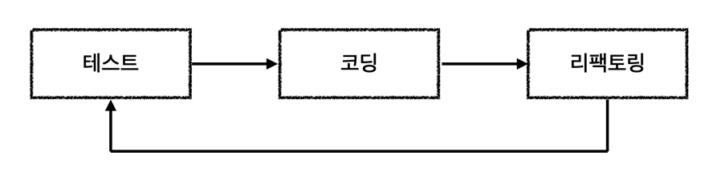

## Day 1 : TDD & 시나리오 분석

## TDD

### TDD(Test Driven Development)란

- TDD는 테스트 주도 개발을 의미합니다. 여기서 말하는 테스트 주도는 단순히 테스트를 먼저 작성하고, 뒤늦게 작성하고를 의미하는 것이 아닙니다.
- 개발의 프로세스에서 유의미한 Test Case를 도출하고 해당 케이스의 예민한 지점이 예상대로 성공하거나 실패를 유발하는 지를 검증하는 것이 중요합니다.
- 유의미한 Test Case를 도출해낸 것을 토대로 기능의 완성도를 높이고 유지보수에 용이하고 유연한 설계를 해나가는 것이 TDD의 진정한 목표입니다.

### Red -> Green -> Refactor 사이클

- TDD는 크게 Red, Green, Refactor의 사이클로 이루어집니다.
- Red : 실패하는 테스트 케이스를 먼저 작성합니다.
- Green : 테스트를 통과할 수 있는 최소한의 코드를 작성합니다.
- Refactor : 코드를 개선하고 중복을 제거합니다.
- 위와 같은 짧은 개발 주기를 가져간다면, 지속적으로 설계를 개선해나가고 빠른 변화에도 유연하게 대처할 수 있습니다.

### 항해 플러스 1주차 프로젝트에서 나의 TDD

- 처음에는 단위 테스트와 통합 테스트, E2E Test를 언제 어떻게 해야하는지에 대한 감이 잘 잡히지 않았습니다.
- 하지만 내가 테스트하고자 하는 대상이 누구이고 그 대상은 누군가의 협력을 필요로하는 객체인지를 명확하게 구분하려했습니다.
- 이러한 노력 끝에 각 레이어 별로 적절한 테스트를 수행했습니다. 또한 서로 다른 해결책을 비교하는 학습 테스트도 수행했습니다.
- 테스트를 수행해나가면서 더 나은 방법은 없을 지 고민하고, 테스트 케이스를 뽑아내면서 책임 분리를 적절하게 수행할 수 있었습니다.
- 피드백에서는 테스트 케이스나 테스트 대상 선정에 대해 누락된 건이 있었는데 이 점을 보완하여 더욱 신뢰성있는 코드를 작성하는 개발자로 거듭나고 싶습니다.

## 시나리오 분석 및 요구사항에 따른 정리 나열

### 잔액/충전 조회 API

- 사용자는 잔액을 충전할 수 있어야 한다.
    - 입력값은 사용자 ID와 충전 금액
    - 입력값 유효성 검사
    - 입력에 따른 사용자 ID에 따른 사용자가 실제로 존재하는 지 검증
    - 충전 금액 검증(0이하 인지, 1,000,000원 이상인지, 5,000,000원 이하인지)
    - 검증 Pass -> 충전 완료
    - **정책** : 충전 금액은 1회 최대 1,000,000원까지 가능하다.
    - **정책** : 보유할 수 있는 최대 잔액은 5,000,000원
    - **정책** : 잔액의 충전 요청이 동시에 발생한다면 동시에 발생한 요청이 정상적으로 반영되어야 한다.
- 사용자는 현재 보유하고 있는 잔액을 조회할 수 있어야 한다.
    - 입력값은 사용자 ID
    - 입력값 유효성 검사
    - 입력받은 사용자 ID에 따른 유저가 실제 존재하는지 검증
    - 검증 Pass -> 현재 보유하고 있는 잔액을 조회

### 상품 조회 API

- 사용자는 상품 목록을 조회할 수 있어야 한다.
    - 상품 목록은 상품 ID, 상품 이름, 상품 가격, 상품 잔여 수량을 포함한다.
    - **비기능적 요구사항** 조회시점의 잔여수량은 실시간으로 정확도가 최대한 높아야한다.

### 선착순 쿠폰 기능

- 사용자는 쿠폰을 발급받을 수 있다.
    - 입력값은 쿠폰 ID
    - 입력값 유효성 검사
    - 입력받은 쿠폰 ID에 따른 쿠폰이 실제하는지 검증
    - 쿠폰 ID에 해당하는 쿠폰의 잔여 수량이 남아있는지 검증
    - 쿠폰을 이미 사용자가 발급받았는지 검증
    - 검증 Pass -> 잔여 수량 차감 및 쿠폰 발급 완료
    - **정책** : 쿠폰은 선착순으로 발급되어야 한다.
    - **정책** : 선착순 쿠폰은 1명의 사용자당, 1개만 발급받을 수 있다.
- 사용자는 보유한 쿠폰 목록을 조회할 수 있다.
    - 입력값은 사용자 ID
    - 입력값 유효성 검사
    - 입력받은 사용자 ID에 따른 사용자가 실제로 존재하는지 검증
    - 검증 Pass -> 사용자가 보유한 쿠폰 목록을 조회
    - **정책** : 쿠폰 적용 정책은 정액 할인 정책과 정률 할인 정책이 있다.
        - 정액 할인 정책은 쿠폰을 사용하면 정해진 금액만큼 할인된다.
        - 정률 할인 정책은 쿠폰을 사용하면 정해진 비율만큼 할인된다.

### 주문 기능

- 사용자는 사용자 식별자와 쿠폰 ID, (상품 ID, 수량) 목록을 입력받아 주문
    - 입력값 검증
        - 사용자 ID에 따른 사용자 실재 여부 검증
        - 상품 ID에 따른 상품이 실제로 존재하는지 검증
        - 수량이 음수가 아닌지 검증
    - 구매하고자 하는 상품 수량이 재고보다 크면 주문 실패
    - 쿠폰 ID가 존재할 경우 쿠폰에 대한 검증 수행
        - 쿠폰 ID에 따른 쿠폰이 실제 존재하는지 검증
        - 쿠폰의 유효 기간을 검증
    - 쿠폰 검증 Pass -> 쿠폰의 적용 정책에 할인된 주문 금액 반환
    - 쿠폰 상태를 사용됨으로 변경
    - 주문 완료 -> 상품 수량 차감, 주문 상태는 미결제 상태
    - 주문 이력 저장

### 결제 기능

- 사용자 식별자와 주문 ID를 받아서 결제
    - 입력값 유효성 검사
        - 사용자가 실제로 존재하는지 검증
        - 주문이 실제로 존재하는지 검증
    - 사용자 포인트 조회
        - 결제 금액이 사용자의 잔액보다 크면 결제 실패
    - 포인트 차감
    - 결제 완료
    - 주문 상태 결제 완료로 변경
    - 주문 정보 데이터 플랫폼에 전송

### 상위 상품 조회

- Orders 테이블을 기반으로 상위 5개 상품 조회
- 사용자는 최근 3일간 가장 많이 팔린 상위 5개 상품 정보를 조회할 수 있다.
    - 상품의 판매량은 상품의 주문 수량을 기준으로 한다.
    - 상품의 판매량은 상품의 주문 수량을 기준으로 내림차순으로 정렬한다.

