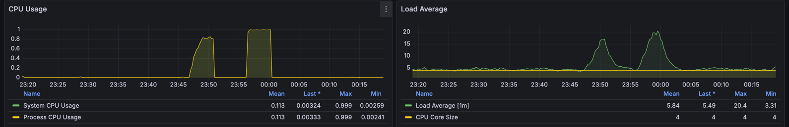

# 항해 플러스 이커머스 프로젝트 성능 테스트 결과 보고서

## 선착순 쿠폰 발급 API 성능 테스트 결과 Summary

항해 플러스 이커머스 쿠폰 발급 시스템에 대한 스파이크 테스트를 통해 시스템의 성능 특성과 운영 한계점을 도출했습니다.  
테스트 결과, 300명 동시 사용자까지는 최적의 성능을 보였으나, 그 2배인 600명에서부터는 응답시간이 급격히 증가하여 사용자 경험  
저하 구간에 진입함을 확인했습니다.

## 📊 테스트 결과 상세 분석

### 테스트 시나리오별 결과

| 항목            | 300 VUs      | 600 VUs      | 변화율          |
|---------------|--------------|--------------|--------------|
| **테스트 시간**    | 1분 30초       | 1분 30초       | -            |
| **총 요청 수**    | 68,769개      | 61,813개      | -10.1%       |
| **처리량 (TPS)** | 764.09 req/s | 686.79 req/s | **-10.1%**   |
| **실패율**       | 0.00%        | 0.00%        | **완벽 안정성**   |
| **쿠폰 발급 성공**  | 10,000개      | 10,000개      | **정확성 100%** |
| **중복 발급 시도**  | 58,769개      | 51,813개      | -11.9%       |

### 응답시간 성능 비교

| 응답시간 지표       | 300 VUs  | 600 VUs  | 성능 변화        |
|---------------|----------|----------|--------------|
| **평균**        | 310.88ms | 675.46ms | **+117% 악화** |
| **중위값 (P50)** | 375.29ms | 798.1ms  | **+113% 악화** |
| **95 퍼센타일**   | 458.94ms | 1.13s    | **+146% 악화** |
| **99 퍼센타일**   | 507.44ms | 1.31s    | **+158% 악화** |
| **최대값**       | 707.87ms | 1.82s    | **+157% 악화** |

### 성능 분석 및 병목 지점

- 600 VUs에서 성능이 저하되는 것을 확인할 수 있었습니다. 처리량이 감소하고 응답 시간이 2배가 증가.
- P95, P99 응답시간이 각각 1초, 1.31초로 증가하여 사용자 경험에 심각한 영향을 미칠 수 있는 수준.
- 병목 지점은 데이터베이스에서의 비관적 락을 사용함으로써 발생하는 것으로 파악.
- 동시 사용자 수가 증가함에 따라 데이터베이스 락 경합이 심화되어 응답 시간이 급격히 증가하는 것으로 분석됨.

### 개선 방안 및 향후 계획

- **비관적 락 제거**: 현재 비관적 락을 사용하고 있어 동시성 문제가 발생. 이를 해결하기 위해 비관적 락을 제거하고,  
  대신 Optimistic Locking 또는 분산 락 시스템(예: Redis)을 도입하여 동시성 문제를 해결할 계획.
- 대규모 이벤트의 경우 카프카와 같은 비동기 메시징 시스템을 일시적으로 도입하여 서비스의 안정성을 높여 브랜드 신뢰성 확보 및
  사용자 경험 개선을 도모할 계획입니다.

## 인기상품 조회 API 성능 테스트 결과 Summary

인기 상품 조회 API에 대해 최대 500VU 부하 테스트를 통해 우수한 성능과 완벽한 안정성을 확인했습니다.  
대용량 트래픽 처리 능력과 일관된 응답 성능을 보여주며, 캐싱 전략이 효과적으로 작동함을 입증했습니다.  
평균 응답 시간이 31ms, P95 수준에서 응답시간이 103ms로 매우 우수한 성능을 보였습니다.

## 📊 테스트 결과 상세 분석

### 핵심 성능 지표

| 지표            | 측정값               | 평가        |
|---------------|-------------------|-----------|
| **총 요청 수**    | 1,536,430개        | 대용량 처리    |
| **처리량 (TPS)** | 6,401.74 req/s    | **매우 우수** |
| **실패율**       | 0.00%             | **완벽**    |
| **데이터 처리량**   | 수신 18GB, 송신 174MB | 고효율       |

### 응답시간 성능 분석

| 응답시간 지표       | 측정값      | 평가 기준    | 결과       |
|---------------|----------|----------|----------|
| **평균**        | 31.64ms  | < 100ms  | ✅ **우수** |
| **중위값 (P50)** | 18.34ms  | < 50ms   | ✅ **우수** |
| **95 퍼센타일**   | 103.63ms | < 200ms  | ✅ **양호** |
| **99 퍼센타일**   | 152.85ms | < 300ms  | ✅ **양호** |
| **최대값**       | 446.46ms | < 1000ms | ✅ **허용** |

### 성능 분석 및 병목 지점

- 평균 31ms로 매우 우수한 성능을 보였고, 점점 증가하는 트래픽에도 안정적인 응답 성능을 유지했습니다.
- 하지만 피크시 CPU 사용률이 100%에 근접하고, 높은 Load Average가 발생하여 서버 리소스에 부담이 가해졌습니다.  
  이는 향후 트래픽 증가에 대비한 리소스 확장이 필요함을 시사합니다.

### 개선 방안 및 향후 계획

- **리소스 확장**: 현재 서버 리소스가 한계에 도달하고 있어, 추가 서버 인스턴스를 배포하여 부하 분산을 고려할 필요가 있습니다.
- 월간, 주간 베스트 셀러와 같이 실시간성이 중요하지 않은 데이터의 경우 로컬 캐시를 적용하여 성능을 더욱 향상시킬 계획입니다.

