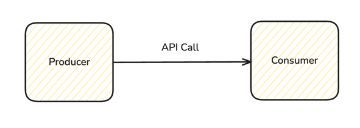
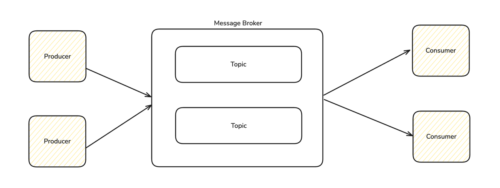
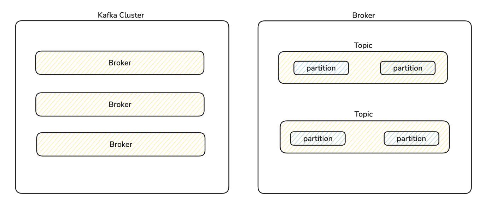
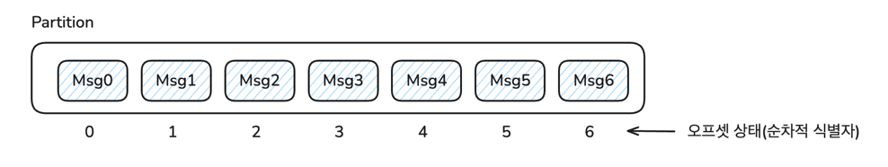
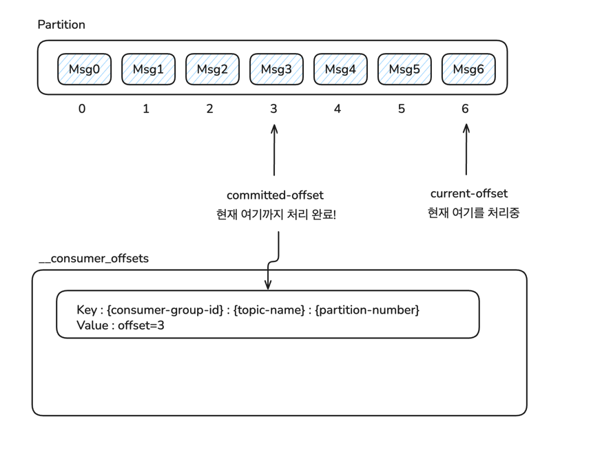

# 아파치 카프카 학습 문서

본 문서에서는 카프카의 기본이 되는 개념과 구성 요소, 그리고 카프카를 사용하는 이유에 대해 설명합니다.

## 카프카란?

아파치 카프카는 링크드인에서 개발한 분산 스트리밍 플랫폼으로, 대용량의 실시간 데이터를 안전하고 빠르게 전송할 수 있는 오픈소스 이벤트 브로커입니다.

### 핵심 특징

- 고성능 : 초당 수백만 건의 메시지 처리가 가능합니다.
- 확장성 : 수평적 확장을 통한 처리량 증대가 가능합니다.
- 내구성 : 디스크에 메세지를 저장하여 데이터 손실을 방지합니다.
- 실시간 처리 : 낮은 지연시간으로 실시간 데이터 스트리밍이 가능합니다.

## 카프카를 사용하는 이유



데이터를 전송하는 가장 간단한 방법은 위 그림처럼 API로 서버 간 통신하는 것입니다. 하지만 API 방식으로 데이터를 전송하고 처리하는 방식은 두 컴포넌트가 직접적으로 결합된다는 단점이 있습니다. 컨슈머에 장애가
발생한다면 프로듀서는 컨슈머를 직접 호출하기 때문에 장애가 전파될 수 있습니다. 그리고 컨슈머에 요청이 전달되지 않는다면 데이터가 유실될 수 있습니다. 또한 시스템이 확장되면서 서비스 간 의존성이 복잡해지고, 동기식
처리로 인한 성능 병목과 트래픽 급증 시 처리 능력의 한계가 드러납니다. 즉 대규모로 데이터를 안전하게, 그리고 고성능으로 처리하는데 한계가 있습니다.

이러한 문제를 해결할 수 있는 것이 카프카와 같은 이벤트 브로커입니다. 카프카는 프로듀서와 컨슈머 사이에 중간 브로커 역할을 하여 두 컴포넌트의 결합도를 낮추고, 직접 연결되어 있지 않으므로 장애 전파 위험을
감소시킬 수 있습니다. 또한 데이터 유실 위험을 낮추고 데이터에 대한 처리가 비동기로 수행될 수도 있습니다. 메시지를 디스크에 영구 저장하여 내구성을 보장하고, 여러 컨슈머가 동일한 데이터를 독립적으로 처리할 수
있어 시스템의 유연성과 확장성을 크게 향상시킵니다.

메세지 브로커 역할을 할 수 있는 기술은 카프카 외에도 RabbitMQ, Redis Pub/Sub 등이 있음에도 카프카가 널리 사용되는 이유는 카프카의 설계와 강력한 기능들 때문입니다. 카프카는 메세지를 메모리가
아닌 디스크에 순차적으로 저장하는 로그 기반 아키텍처를 채택하여 높은 처리량과 내구성을 동시에 달성합니다.

가장 많이 비교되는 RabbitMQ와의 차이점은 RabbitMQ는 전통적인 메시지 큐 방식으로 메시지를 메모리에 저장하고 소비 후 삭제하는 구조인데 이는 낮은 지연시간과 복잡한 이벤트 라우팅 기능을 제공하지만,
메시지가
소비되면 사라지기 때문에 재처리나 다중 컨슈머 시나리오에 제약이 있습니다. 뿐만 아니라 메세지를 메모리에 저장하기 때문에 처리가 빠르지만 유실의 위험이 큽니다. 반면 카프카는 메시지를 디스크에 영구 저장하는 로그
기반 시스템으로, 설정된 보관 기간 동안 메시지를 유지하여 여러 컨슈머가 동일한 데이터를
독립적으로 처리할 수 있습니다. 따라서 실시간 알람이나 작업 큐 처럼 즉시 처리가 필요한 경우에는 RabbitMQ가 적합하지만, 대용량 데이터 파이프라인이나 이벤트 소싱, 로그 수집 같은 스트리밍 데이터 처리에는
카프카가 더 적합합니다. 또한 카프카는 수평적 확장성과 내결함성 측면에서 RabbitMQ보다 우수합니다.

##               

## 카프카의 구성요소

카프카는 크게 **프로듀서**, **컨슈머**, **브로커**로 구성되어 있습니다.



### 브로커



브로커는 카프카의 핵심 컴포넌트로, 메세지를 저장하고 관리하며 프로듀서와 컨슈머 간의 데이터 중계 역할을 수행합니다. 하나의 Kafka 인스턴스가 곧 하나의 브로커이며, Kafka 클러스터는 일반적으로 다수의
브로커로 구성되어 있습니다. 브로커는 하나 이상의 토픽을 관리하며, 각 토픽은 내부적으로 여러 파티션으로 분할되어 있습니다. 파티션은 Kafka의 병렬 처리 단위이자 데이터 저장 단위로 브로커는 각 파티션의 데이터를
디스크에 순차적으로 저장합니다.

카프카는 일반적으로 3대 이상의 브로커로 구성된 클러스터로 운영됩니다. 이는 고가용성과 내결함성을 확보하기 위함입니다. 카프카는 파티션의 복제 메커니즘을 통해 장애 대응을 지원합니다. 각 파티션은
replication.factor 값에 따라 여러 브로커에 복제되며, 이 중에 하나가 리더가 되고 나머지는 팔로워가 됩니다. 리더 브로커에 장애가 발생하면 카프카는 In-Sync Replica(ISR) 중 하나를
새로운 리더로 선출해야 하는데 브로커 한두 대가 장애를 일으켜도 서비스 중단 없이 메세지를 수신/전달할 수 있는 구조를 확보합니다. 3대 이상으로 구성을 하면 적어도 하나 이상의 리더와 팔로워가 살아 있는 상황을
만들 수 있어 ISR을 유지할 확률이 높아지고, 안정적인 운영이 가능합니다.

물론 이는 acks라는 설정이 all일 때만 유효합니다. acks 설정은 프로듀서가 메세지를 전송할 때, 브로커가 메세지를 수신했음을 확인하는 방식입니다. 설정에 따른 동작 방식은 아래와 같습니다.

- `acks=0`: 프로듀서는 메세지를 전송한 후 브로커의 응답을 기다리지 않습니다. 이 경우 메세지 유실이 발생할 수 있습니다.
- `acks=1`: 프로듀서는 리더 브로커가 메세지를 수신했음을 확인한 후 응답을 받습니다. 이 경우 리더 브로커에 장애가 발생하면 메세지가 유실될 수 있습니다.
- `acks=all`: 프로듀서는 ISR에 속한 모든 브로커가 메세지를 수신했음을 확인한 후 응답을 받습니다. 이 경우 모든 브로커가 메세지를 안전하게 저장하므로 데이터 유실 위험이 가장 낮습니다.

### 프로듀서

프로듀서는 카프카에 데이터를 전송하는 역할을 합니다. 프로듀서는 특정 토픽에 메시지를 전송하며, 메시지는 내부적으로 파티션 단위로 나뉘어 저장됩니다. 어떤 파티션으로 메시지를 보낼지는 키 기반 해시, 라운드로빈,
커스텀 전략에 따라 결정됩니다. 프로듀서는 카프카로 메시지를 보낼 때, 데이터를 직렬화한 후 내부 배치 버퍼에 적재합니다. 이후 일정량 이상 쌓이거나 시간이 경과하면 배치된 메시지를 네트워크를 통해 브로커로
전송합니다. 또한 acks 설정을 통해 신뢰성 수준을 조절하고, 재시도 메커니즘과 압축을 통해 안정적이고 효율적인 데이터 전송을 보장합니다.

### 컨슈머

컨슈머는 카프카에서 데이터를 읽어오는 역할을 합니다. 컨슈머는 특정 토픽을 구독하여 메시지를 소비하며, 컨슈머 그룹을 통해 여러 인스턴스가 협력하여 파티션을 분산 처리할 수 있습니다. 하나의 파티션은 동일한 컨슈머
그룹 내에서 최대 하나의 컨슈머 인스턴스에만 할당되어 순서 보장과 중복 처리를 방지합니다. 컨슈머는 오프셋을 통해 현재 읽은 위치를 추적하며, 이를 내부 토픽(__consumer_offsets)에 주기적으로 커밋하여
장애 복구 시 올바른 지점부터 재개할 수 있습니다. 메시지를 읽어올 때는 poll() 메서드를 통해 배치 단위로 가져오며, 처리 완료 후 수동 또는 자동으로 오프셋을 커밋합니다. 컨슈머 그룹에서 인스턴스가 추가되거나
제거될 때는 리밸런싱이 발생하여 파티션 할당을 재조정하고, 이 과정에서 일시적으로 메시지 처리가 중단될 수 있습니다.

### 컨슈머의 오프셋 관리

오프셋은 각 파티션 내에서 메시지의 고유한 순차적 식별자로, 컨슈머가 어디까지 메시지를 읽었는지를 추적하는 핵심 메커니즘입니다.



오프셋에는 current-offset(현재 읽고 있는 오프셋)과
committed-offset(커밋된 오프셋)이 있으며, current-offset은 컨슈머가 현재 처리 중인 메시지의 위치를 나타내고, ```committed-offset```은 처리 완료를 보장하기 위해 카프카에 영구
저장된 오프셋입니다. 카프카는 컨슈머가 커밋한 오프셋 정보를 __consumer_offsets라는 내부 토픽에 저장하여 관리합니다.



오프셋 커밋 방식에는 자동 커밋과 수동 커밋이 있으며, 자동 커밋은 enable.auto.commit=true 설정으로 일정 간격마다 current-offset을 자동으로 committed-offset으로 저장하고,
수동 커밋은 개발자가 명시적으로 commitSync() 또는
commitAsync() 메서드를 호출하여 처리 완료 후 오프셋을 저장합니다. 컨슈머가 재시작되거나 리밸런싱이 발생할 때, committed-offset부터 메시지 처리를 재개하여 중복 처리나 메시지 누락을
방지합니다. 오프셋 관리 전략에 따라 at-most-once(최대 한 번), at-least-once(최소 한 번), exactly-once(정확히 한 번) 시맨틱을 구현할 수 있으며, 이는 메시지 처리와 오프셋
커밋 순서에 따라 결정됩니다.

