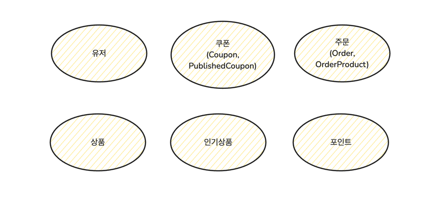
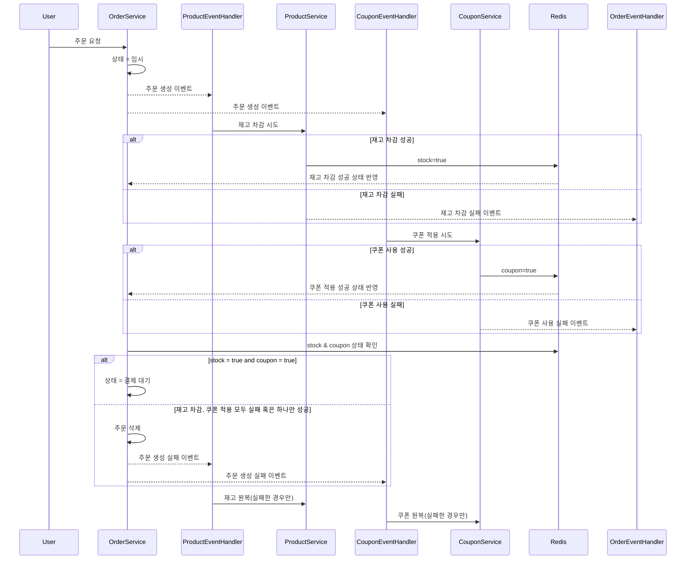

# Road To Microservice Architecture

본 문서에서는 항해 플러스 이커머스 프로젝트의 MSA 전환을 준비하기 위해 선행되어야 하는 사전 작업에 대해서 설명합니다.

## 도메인 별 서비스 분리

현재의 모놀리식 아키텍처에는 도메인 별로 서비스가 나누어져 있지 않습니다. 하지만 MSA로 전환하기 위해서는 각 도메인 별로 서비스가 나뉘어져야 합니다.
우리의 시스템에는 주문, 인기 상품, 상품, 쿠폰, 포인트, 유저 도메인이 존재합니다. 따라서 이를 각각의 서비스로 나눈다면 아래와 같이 서비스를 구성할 수 있습니다.



- 주문 서비스 : 주문과 관련된 모든 기능을 담당합니다. 주문 생성, 주문 조회, 주문 상태 변경 등의 기능을 포함합니다.
- 인기 상품 서비스 : 인기 상품과 관련된 모든 기능을 담당합니다. 인기 상품 조회 등의 기능을 포함합니다.
- 상품 서비스 : 상품과 관련된 모든 기능을 담당합니다. 상품 등록, 상품 조회, 상품 재고 차감 등의 기능을 포함합니다.
- 쿠폰 서비스 : 쿠폰과 관련된 모든 기능을 담당합니다. 쿠폰 발급, 쿠폰 사용 등의 기능을 포함합니다.
- 포인트 서비스 : 포인트와 관련된 모든 기능을 담당합니다. 포인트 적립, 포인트 사용 등의 기능을 포함합니다.
- 유저 서비스 : 유저와 관련된 모든 기능을 담당합니다.

## 완벽한 서비스 분리를 위해 수행되어야 하는 사전 작업 : 이벤트를 활용한 서비스 간의 느슨한 결합

현재 우리의 시스템은 모놀리식 아키텍처로 구현되어 있으며, 여러 도메인 서비스 간의 협력이 파사드 계층을 통해 하나의 트랜잭션 범위 안에서 동기적으로 처리되고 있습니다.   
예를 들어, 주문 생성과 동시에 결제 수행 및 재고 차감, 쿠폰 사용 등이 모두 하나의 트랜잭션 안에서 실행됩니다. 하지만 MSA로 전환하게 되면 각 도메인(주문, 결제, 재고, 쿠폰 등)이 서로 다른 독립적인  
마이크로서비스로 분리되며, 각 서비스는 자신의 로컬 데이터베이스를 관리하고 자체적으로 배포됩니다. 이로 인해 더 이상 하나의 트랜잭션으로 모든 작업을 묶을 수 없게 됩니다.  
이러한 이유로, MSA로 전환하기 이전에 우리의 시스템을 비동기 이벤트를 활용하여 서비스 간의 느슨한 결합을 구현해야 합니다.

### 현재의 상황

현재 우리의 프로젝트에서 여러 서비스가 하나의 기능을 완성하는 대표적인 사례는 주문과 결제입니다. 주문 기능의 경우  
아래와 같이 주문 퍼사드 계층에서 주문, 상품, 쿠폰 서비스를 주입받아서 하나의 트랜잭션에서 처리되고 있습니다.

```text
주문 TX() {
    주문_객체_생성();
	상품서비스#상품_재고_차감();
	쿠폰서비스#쿠폰_사용();
	주문서비스#주문_정보_저장();
}
```

```text
결제 TX() {
    주문서비스#주문_정보_조회();
    포인트서비스#결제_정보_저장();
    주문서비스#주문_상태_변경();
    주문 정보 데이터 플랫폼 전송();
}
```

주문의 경우를 보면, 주문서 하나를 완성하기 위한 모든 작업들이 하나의 트랜잭션에서 처리되고 있고 모든 작업이 성공해야만 최종적으로 데이터베이스에 반영되기 때문에  
강력한 데이터 일관성을 보장합니다. 하지만 주문서 하나를 생성하기 위한 과정이 더욱 복잡해진다면 어떻게 될까요? 배송 정보를 등록하거나 물류 시스템으로 전송하거나,  
주문이 정상적으로 완료되었다는 알림톡을 발송하는 로직이 추가된다면, 장기 트랜잭션으로 인한 데드락 문제가 발생하고, 값비싼 자원인 DB 커넥션 풀을 오래 물고 있게 되어  
여러 사용자가 동시에 몰리는 상황에서 성능 저하를 초래할 수 있습니다.

또한 주문 정보 데이터 플랫폼을 전송하거나, 알림톡을 보내는 것은 애플리케이션의 메인 비즈니스 로직이라기 보다는, 부가적은 기능으로 볼 수 있습니다.  
그런데 위와 같은 퍼사드에 `@Transactional`이 달려있는 구조에서는 부가 기능이 실패해도 전체 작업이 롤백됩니다. 하지만 알림톡 발송이나 내부적으로 필요로 하는  
주문 정보를 데이터 플랫폼에 전송하는 작업은 재처리 프로세스를 통해 다시 수행되어도 되는 기능들입니다.

## 해결책 : Spring의 ApplicationEvent

Spring에서는 `ApplicationEventPublisher`를 통해 이벤트를 발행하고, 이를 구독하는 리스너를 등록하여 처리할 수 있습니다.
이벤트를 활용하면 서비스 간의 결합도를 낮추고, 각 서비스가 독립적으로 동작할 수 있도록 할 수 있습니다. 따라서 하나의 퍼사드 메서드에 `@Transactional`을 붙여서  
여러 서비스에서 수행하는 작업을 하나의 트랜잭션으로 묶는 것이 아니라, 각 서비스에서 수행하는 작업을 동기, 혹은 비동기적으로 처리할 수 있습니다. 뿐만 아니라  
부가 로직을 핵심 비즈니스 로직에서 분리할 수 있습니다.

### 주문 로직의 변경

스프링의 `ApplicationEvent`를 활용하면 다음과 같이 주문서 생성 로직을 변경할 수 있습니다.

```kotlin
OrderService {
    @Transactional
    주문_임시_저장() {
        // 임시로 주문 저장 (예: 상태 = 임시)

        // 주문 생성 이벤트 발행
    }
}

ProductService {
    @Transactional
    상품_재고_차감() {
        // 재고 차감 로직
        // 재고 차감 성공 이벤트 발행
    }

    @Transactional
    상품_재고_복구() {
        // 주문서에 들어있었던 상품의 재고를 복구하는 로직
    }
}

CouponService {
    @Transactional
    쿠폰_사용() {
        // 쿠폰 유효성, 상태 변경, 할인 금액 적용 등 처리
        // 쿠폰 사용 성공 이벤트 발행
    }

    @Transactional
    쿠폰_복구() {
        // 주문에 적용되었던 사용자의 쿠폰 복구 로직
    }
}
```

주문 파사드에 존재했던 주문 생성, 재고 차감, 쿠폰 적용 로직이 각 도메인 서비스에서 실행하게 하고 실행 이후의 결과에 따라  
성공 혹은 실패 이벤트를 발행합니다. 그리고 이 이벤트를 발행한 것을 처리하기 위해 아래와 같은 이벤트 핸들러를 작성합니다.

```kotlin
ProductEventHandler {

    @TransactionalEventListener(AFTER_COMMIT)
    @Async
    handleOrderCreated(주문 생성 이벤트) {
        try {
            // 재고 차감
        } catch (ProductException e) {
            // 재고 차감 실패 이벤트 발행
        }
    }
}

CouponEventHandler {

    @TransactionalEventListener(AFTER_COMMIT)
    @Async
    handleOrderCreated(주문 생성 이벤트) {
        try {
            // 쿠폰 적용
        } catch (CouponException e) {
            // 쿠폰 사용 실패 이벤트 발행
        }
    }
}

```

`@TransactionalEventListener`를 사용하면 트랜잭션의 단계에 따라 이벤트를 처리할 수 있습니다. 주문 로직에서는 현재
임시 주문을 생성하는 작업이 커밋된 후 재고 차감, 그리고 쿠폰 적용까지 모두 성공해야만 주문이 확정됩니다. 따라서 `@TransactionalEventListener(phase = AFTER_COMMIT)`로
설정합니다.

### 비동기적 처리에 대한 고민

위의 의사 코드에서 우리는 `@Async` 어노테이션을 사용하여 주문 생성 이벤트를 발행한 뒤에 재고 차감과 쿠폰 적용을 비동기로 동작하도록 했습니다.  
하지만 비동기 처리를 하게 되면 몇 가지 문제가 발생할 수 있습니다. 예를 들어, 재고 차감이 성공했지만 쿠폰 사용이 실패하는 경우가 발생할 수 있습니다.
반대로 쿠폰 사용이 성공했지만 재고 차감이 실패하는 경우도 발생할 수 있습니다. 실제 주문서가 최종적으로 생성되려면 이 두 가지를 모두 성공해야 합니다.

따라서 두 개의 이벤트가 모두 성공했다는 것을 확인하기 위해서는 레디스나 DB와 같은 저장소에 주문 ID별 재고 차감 성공, 쿠폰 적용 성공이라는 플래그를 두고 이벤트 성공 시  
해당 플래그를 업데이트하는 방법을 사용할 수 있습니다.

```kotlin
OrderEventHandler {

    @EventListener
    @Async
    handleStockDecreaseSuccess(재고 차감 성공 이벤트) {
        // Redis에 주문 ID에 따른 재고 차감 성공 플래그를 true로 업데이트
    }

    @EventListener
    @Async
    handleCouponAppliedSuccess(쿠폰 적용 성공 이벤트) {
        // Redis에 주문 ID에 따른 쿠폰 적용 성공 플래그를 true로 업데이트
    }

    @EventListener
    @Async
    handleStockDecreaseFailed(재고 차감 실패 이벤트) {
        // Redis에 주문 ID에 따른 쿠폰 적용 성공 플래그를 false로 업데이트
    }

    @EventListener
    @Async
    handleCouponAppliedFailed(쿠폰 적용 실패 이벤트) {
        // Redis에 주문 ID에 따른 쿠폰 적용 성공 플래그를 false로 업데이트
    }
}

OrderService {
    주문_상태_업데이트() {
        // 재고 or 쿠폰 플래그 업데이트
        // 둘 다 성공했다면 실제 주문 상태를 PENDING으로 변경
        // 둘 중 하나라도 실패했다면, 주문 제거하고 주문 실패 이벤트 발행
    }
}
```

이렇게 하면 비동기로 실행되도록 한 이벤트(재고 차감, 쿠폰 적용)가 잘 처리되었는 지 확인하고, 잘 처리되었다면 주문 상태를 PENDING으로 변경합니다.  
만약 두 이벤트 중 하나라도 실패했다면 주문을 제거하고 주문 실패 이벤트를 발행합니다. 그리고 다시 이 주문 실패 이벤트를 바라보고 있는 Listener가 있다면  
차감된 재고 혹은 사용된 쿠폰을 복구하는 로직을 실행합니다. 이를 시퀀스 다이어그램으로 표현하면 아래와 같습니다.



### Spring ApplicationEvent의 한계

Spring의 ApplicationEvent는 이벤트를 발행하고 구독하는 방식으로 서비스 간의 느슨한 결합을 구현할 수 있습니다. 하지만 이 방식은 몇 가지 한계가 있습니다.
비동기 처리의 예외 발생, 이벤트의 순서 보장, 이벤트의 중복 처리 등의 문제를 해결하기 위해서는 개발자가 직접 이를 구현해야합니다.  
또한 단일 JVM 환경에서만 동작하기 때문에, 분산 시스템에서 이벤트 전파가 불가능합니다. 뿐만 아니라 모니터링, 장애 처리, 재처리 등의 기능이 부족합니다.

## 결론

Spring의 `ApplicationEvent`를 활용하여 모놀리식 아키텍처에서 이벤트 기반으로 하여금 서비스 간의 느슨한 결합을 구현할 수 있었습니다.  
하지만 살펴본 것처럼 `ApplicationEvent`는 몇 가지 한계가 있습니다. 그 중 비동기 처리와 관련해서는 그 관리의 복잡도가 매우 높습니다.
따라서 완전히 MSA로 전환하기 위해서는 이러한 한계를 극복할 수 있는 방법을 찾아야 하는데 대표적인 것이 Kafka, RabbitMQ와 같은 메시지 큐를  
도입하는 것이 필수적입니다.

