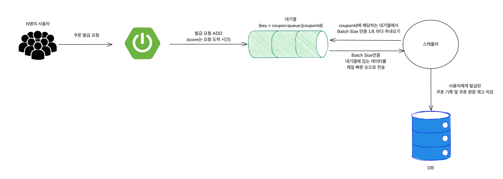
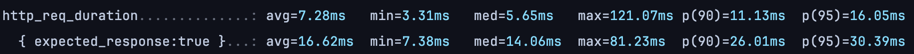
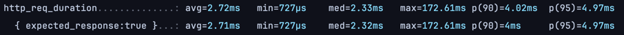

# 항해 플러스 이커머스 프로젝트 선착순 쿠폰 발급 개선 보고서

본 문서에서는 선착순 쿠폰 발급을 기존의 분산 락(Pub/Sub) 방식에서 레디스를 사용한 대기열 방식으로 개선한 내용을 다룹니다.

## 배경 : 더 높은 트래픽에 취약할 수 있는 분산 락

기존의 분산 락 방식은 데이터 정합성 측면에서 안정적이지만 다수의 사용자가 동시에 쿠폰 발급을 요청하는 경우에는 응답 지연이  
커질 수 있습니다. Redisson을 사용한 Pub/Sub락은 높은 트래픽이 발생하는 환경에서는 분명 스핀 락보다는더 나은 방식이지만,  
락 대기 시간이 존재하고 그 동안 서버 스레드는 대기 상태에 놓이게 되므로 트래픽이 매우 큰 환경에서 애플리케이션 리소스가  
빠르게 고갈될 가능성이 있습니다.

## 개선 : Sorted Set을 활용한 대기열 방식

이를 개선하기 위해 Sorted Set을 활용한 대기열 구조를 채택했습니다. Redis에서 Sorted Set은 key 하나에 여러 개의 value와  
score를 저장할 수 있는 자료구조입니다. Value는 score로 정렬되며, 중복되지 않습니다. 또한 대부분의 연산이 O(log N)의 시간 복잡도로 상당히 효율적입니다.

아래는 구현 방식을 도식화한 그림입니다.

1. 쿠폰 발급 요청이 들어오면 쿠폰 발급 대기열에 요청을 추가합니다.
2. 쿠폰 발급 대기열에 요청이 추가되면, Redis Sorted Set의 score를 기준으로 정렬됩니다.
3. redisTemplate.opsForZSet().addIfAbsent() 메서드를 사용하여 요청을 추가합니다. 이 메서드는 요청이 이미 존재하는 경우에는 추가하지 않습니다.
4. 그리고 스케줄러가 정기적으로 대기열을 확인하여 발급 가능한 쿠폰을 발급하고 그 결과를 DB에 저장합니다.
5. 발급이 완료된 쿠폰은 대기열에서 제거합니다. 이때, 발급된 쿠폰의 ID를 사용하여 대기열에서 해당 요청을 삭제합니다.

## 분산 락 VS Sorted Set 성능 테스트 비교

- 테스트 환경
    - 테스트 도구 : k6
    - 시스템 구성 : Redis 7.4.2(single), Spring Boot 3.4.1, Java 17, MySQL 8.0
    - 실행 환경 : MacBook Pro (Apple M3 Pro, 12-core CPU, 36GB RAM)
    - 테스트 도구: k6 v0.55.2 (go1.23.4, darwin/arm64)

- 테스트 시나리오
    - 시작 단계: 10초 동안 0에서 초당 100개 요청으로 점진적 증가
    - 지속 단계: 30초 동안 초당 100개 요청 유지
    - 감소 단계: 5초 동안 트래픽 점진적 감소
    - 가상 사용자: 10,000명의 사용자 풀에서 무작위 선택

### 분산 락 성능 테스트 결과

1. 전체 요청은 짧은 응답 시간이 주를 이루지만, 일부 요청에서 지연이 발생하는 점이 발견되었습니다.
2. 성공적인 응답은 평균적으로 더 긴 응답 시간을 보였으며, 특히 상위 95%의 경우 30ms를 초과하는 등 상대적으로 긴 처리 시간을 보였습니다.
3. 상위 5%의 지연을 줄이는 최적화가 필요할 수 있으며, 특히 성공 처리 로직에서의 병목을 점검하는 것이 필요해 보입니다.

### Sorted Set 기반 대기열 성능 테스트 결과

1. 전체 응답 시간과 성공적인 응답의 평균, 중앙값이 거의 동일하여, 성공적인 요청이 매우 안정적인 처리 성능을 보였습니다.
2. 최대 응답 시간이 분산 락보다 높은 편이나, 스케줄러가 주기적으로 대기열을 비우는 구조에서 기인한 것으로 예상됩니다.
3. 상위 95%의 응답 시간도 5ms 미만으로, 대부분의 요청이 매우 빠르게 처리되었다는 점에서 분산 락 방식에 비해 개선된 성능을 보였습니다.

### 결론

종합하면, 분산 락의 경우 락 획득 시도 및 해제, 대기 시간 등으로 인해 네트워크 지연이 응답 시간에 영향을 주는 반면,  
Sorted Set 기반 대기열 방식은 락을 적용하지 않고도 대기열에 대한 순서를 보장하므로써 빠른 응답이 가능함을 보여주었습니다.  
특히나 인상적인 것은 전체 응답과 성공 응답의 차이가 거의 없다는 점이며, 높은 트래픽에도 불구하고 안정적인 성능과  
부하 내성을 가지고 있음을 확인할 수 있었습니다.

