# 항해 플러스 이커머스 프로젝트 Redis 도입

본 문서에서는 항해 플러스 이커머스 프로젝트에서 Redis의 분산 락 기능과 캐시 기능을 도입한 배경과 구현 과정, 성능 개선 효과에 대해 설명합니다.

## 배경1 : 레디스의 분산락 기능을 활용

현재 우리의 프로젝트에서는 포인트 충전과 사용, 재고 증감, 선착순 쿠폰 발급과 같이 동시성 문제가 발생할 수 있는 주요 지점에 락을 적용하고 있습니다.  
그중에서도 하나의 자원에 여러 사용자가 동시에 접근할 수 있는 재고 증감과 쿠폰 발급에는 비관적 락을 적용해 경쟁 상황을 미리 차단하고 있습니다.  
반면, 동시 접근 빈도가 상대적으로 적은 포인트 충전과 사용에는 낙관적 락을 적용해 충돌 시점에만 제어하도록 하여 성능을 최적화하는 방향으로 운영하고 있습니다.

하지만 비관적 락과 낙관적 락은 각각의 한계를 가지고 있습니다. 비관적 락은 데이터 충돌을 예방하기 위해 락을 잡고 있는 동안 DB 커넥션을 지속적으로 점유하게 됩니다.  
이는 동시 접속자가 많아질수록 DB 부하를 증가시키고, 데드락이 발생할 위험도 높아지는 문제가 있습니다. 반면, 낙관적 락은 충돌을 허용하고 그 시점에서만 제어하는 방식이기 때문에 평상시에는 성능이 우수하지만,  
충돌이 빈번하게 발생하는 상황에서는 재시도 로직이 과도하게 실행되며 성능 저하로 이어질 수 있습니다.

이런 문제를 해결하고 분산 환경에서도 안정적인 동시성 제어를 보장하기 위해 Redis 기반의 분산 락을 도입하기로 결정했습니다.  
Redis를 활용한 분산 락은 여러 인스턴스 간에 글로벌하게 자원에 락을 걸 수 있어, 인스턴스가 몇 개이든 하나의 자원에 대한 일관된 접근 제어가 가능합니다.  
또한, 락을 DB가 아닌 Redis에서 관리하게 되므로 DB 커넥션을 점유하지 않고 빠르게 락을 처리할 수 있어 DB 부하를 줄일 수 있습니다.  
이러한 특성 덕분에 분산 환경에서도 락 충돌 없이 확장 가능한 구조를 구축할 수 있습니다.

## Redis 분산 락의 종류 및 비교 분석

### Simple Lock

Simple Lock은 가장 기본적인 락으로, 락을 획득하기 위해 SET 명령어에 NX(키가 없을 때만)와 PX(만료 시간 설정) 옵션을 함께 사용합니다.  
락 해제는 반드시 락 소유자를 검증한 후 Lua 스크립트를 통해 원자적으로 처리해야 하며, 단순한 DEL 명령은 잘못된 해제를 유발할 수 있습니다.  
Simple Lock 방식은 락 경합이 심하지 않고 복잡한 락 관리가 필요 없는 경우에 적합합니다.

### Spin Lock

Spin Lock은 기본적인 개념은 Simple Lock과 동일하지만, 락을 획득하지 못했을 때 일정 시간 간격으로 계속 락 획득을 시도합니다.

```java
while(!tryLock()){
	Thread.

sleep(100); // 획득 대기
}
```

Spin Lock은 기본적으로 Simple Lock과 유사하지만, 락 획득에 실패했을 경우 일정 시간 간격으로 재시도합니다.  
예를 들어 `Thread.sleep(100)`과 함께 루프를 돌면서 Redis에 반복 요청을 보내는 방식입니다.  
이 방식은 락 보유 시간이 짧고, 빠르게 회전되는 경합 상황에서 유리합니다. 반면 락 보유 시간이 길면 Redis에 지속적인 요청이 발생해 부하가 커질 수 있습니다.  
락을 반드시 획득해야 하는 비즈니스 상황(예: 선착순 재고 감소)에서 유용하지만, 무한 루프 방지를 위한 재시도 횟수나 타임아웃 제한을 반드시 반드시 설정해야 합니다.

### Pub/Sub Lock

Pub/Sub Lock은 Redis의 Pub/Sub 기능을 활용하여 락 경쟁 상황에서 발생하는 반복 요청을 줄이기 위한 이벤트 기반의 락 구현 방식입니다.  
일반적으로 Spin Lock은 락을 획득하지 못했을 때 일정 주기로 Redis에 재시도 요청을 보내는 구조이므로, 락 경합이 심한 환경에서는 Redis 서버에  
지속적인 부하를 유발할 수 있습니다. 이에 반해 Pub/Sub Lock은 락을 획득하지 못한 클라이언트가 Redis 채널을 구독하고 락 보유자가 작업을 마치고  
락을 해제할 때 해당 채널로 이벤트를 발행함으로써, 비동기적으로 락 해제 시점을 통지받고 다시 락 획득을 시도합니다.

이 방식은 락을 획득하지 못한 클라이언트가 Redis에 지속적으로 요청을 보내지 않기 때문에, 락 경합이 심한 환경에서도 Redis 서버에 부하를 줄일 수 있습니다.  
Spin Lock에 비해 CPU를 점유하고 있지 않으므로 리소스 사용에 있어서 Spin Lock에 비해 더 효율적입니다.

하지만 이 방식은 구현 복잡도가 높다는 점이 가장 큰 부담입니다. Pub/Sub Lock은 비동기 이벤트 기반으로 흐름을 제어해야 하기 때문에  
Simple Lock이나 Spin Lock에 비해 더 많은 보완 로직 작성을 요구합니다. 보완 로직이란 메시지 유실, 커넥션 관리, 락 획득 재시도 및 실패 시  
재구독 처리와 같은 것들이 있습니다. 이러한 이유로 Pub/Sub Lock은 Redisson과 같은 고수준의 Redis 클라이언트 라이브러리를 사용합니다.

본 문서에서는 데이터 정합성을 보장하는 Spin Lock과 Pub/Sub Lock의 구현 결과에 대해서만 알아보겠습니다.

## Lock 구현을 위해 사용할 수 있는 Redis 라이브러리

Redis Lock 구현을 위해서 사용할 수 있는 라이브러리는 Lettuce와 Redisson이 있습니다. Redisson은 고수준의 락 추상화 인터페이스를 제공합니다.  
반면 Lettuce는 락 구현을 기본적으로 제공하지 않습니다. 따라서 락 제어 로직을 개발자가 직접 구현해야 합니다. 하지만 Lettuce는 Redisson에 비해  
가볍고 빠르며, 원하는 방식대로 락 구현 방식을 설계할 수 있습니다. 이를 고려하여 Lettuce로는 Spin Lock을, Redisson으로는 Pub/Sub Lock을 구현했습니다.
채택한 시나리오는 선착순 쿠폰 발급 시나리오입니다.

### 선착순 쿠폰 발급 Spin Lock 구현 및 테스트

Spin Lock을 선착순 쿠폰 발급 로직에 적용하기 위해 어노테이션과 AOP를 활용했습니다.

```java

@Target(ElementType.METHOD)
@Retention(RetentionPolicy.RUNTIME)
public @interface SpinLock {

	String key();

	long waitTimeMillis() default 2000;

	long leaseTimeMillis() default 5000;

	long retryInterval() default 100;
}

@Aspect
@Component
@RequiredArgsConstructor
@Order(Ordered.HIGHEST_PRECEDENCE) // @Transactional보다 먼저 수행되어야 함을 의미한다.
@Slf4j
public class SpinLockAspect {

	private final StringRedisTemplate stringRedisTemplate;

	private static final ThreadLocal<String> LOCK_VALUE = ThreadLocal.withInitial(() -> UUID.randomUUID().toString());

	private static final DefaultRedisScript<Long> UNLOCK_SCRIPT = new DefaultRedisScript<>(
		"if redis.call('get', KEYS[1]) == ARGV[1] then " +
			"return redis.call('del', KEYS[1]) " +
			"else return 0 end", Long.class);

	@Around("@annotation(kr.hhplus.be.server.support.aop.lock.SpinLock)")
	public Object applySpinLock(ProceedingJoinPoint joinPoint) throws Throwable {
		MethodSignature signature = (MethodSignature)joinPoint.getSignature();
		Method method = signature.getMethod();
		SpinLock spinLock = method.getAnnotation(SpinLock.class);

		String key = CustomSpringELParser.getDynamicValue(
			signature.getParameterNames(),
			joinPoint.getArgs(),
			spinLock.key());
		String value = LOCK_VALUE.get();

		long startTime = System.currentTimeMillis();
		long deadline = startTime + spinLock.waitTimeMillis();

		log.info("[락 시도 시작] key={}, waitTime={}ms, leaseTime={}ms", key, spinLock.waitTimeMillis(),
			spinLock.leaseTimeMillis());

		// 현재 시간이 deadline보다 작을 때까지 반복 -> 스핀 락이 무한히 돌면서 서버에 부하를 주는 것을 방지
		while (System.currentTimeMillis() < deadline) {
			Boolean acquired = stringRedisTemplate.opsForValue()
				.setIfAbsent(key, value, Duration.ofMillis(spinLock.leaseTimeMillis()));

			if (Boolean.TRUE.equals(acquired)) {
				log.info("[락 획득 성공] 키={}, 값={}", key, value);
				try {
					// 1) 비즈니스 로직 실행
					return joinPoint.proceed();
				} finally {
					// 2) 즉시 락 해제
					releaseLock(key, value);
				}
			}

			log.info("[락 재시도] 키={}, 경과시간={}ms", key, System.currentTimeMillis() - startTime);

			try {
				Thread.sleep(spinLock.retryInterval()); // 재시도 간격 = 100ms 만큼 대기
			} catch (InterruptedException ie) {
				Thread.currentThread().interrupt();
				log.error("[락 중단(인터럽트)] 키={}, 경과시간={}ms", key, System.currentTimeMillis() - startTime, ie);
				break;
			}
		}
		long elapsed = System.currentTimeMillis() - startTime;
		log.warn("[락 획득 실패] 키={}, 경과시간={}ms (타임아웃 {}ms)", key, elapsed, spinLock.waitTimeMillis());
		throw new IllegalStateException("락 획득 실패: " + key);
	}

	/**
	 * 실제 락 해제 로직과 로그 기록.
	 */
	private void releaseLock(String key, String value) {
		Long deleted = stringRedisTemplate.execute(UNLOCK_SCRIPT,
			Collections.singletonList(key),
			value);
		if (deleted > 0) {
			log.info("[락 해제] 키={}, 값={}", key, value);
		} else {
			log.warn("[락 해제 스킵] 키={} (소유자 아님 또는 이미 해제됨)", key);
		}
		LOCK_VALUE.remove();
	}
}

@DistributedLock(key = "'coupon:' + #command.couponId")
@Transactional
public void issueCouponV4(CouponIssueCommand command) {
	if (couponRepository.existsPublishedCouponBy(command.userId(), command.couponId())) {
		throw new CouponAlreadyIssuedException();
	}

	Coupon coupon = couponRepository.findById(command.couponId());
	coupon.issue();

	Coupon savedCoupon = couponRepository.save(coupon);
	PublishedCoupon publishedCoupon = PublishedCoupon.create(command.userId(), savedCoupon, LocalDate.now());
	couponRepository.savePublishedCoupon(publishedCoupon);
}
```

그리고 이를 테스트하는 코드를 작성하고 실행시켜본 결과는 아래와 같습니다.

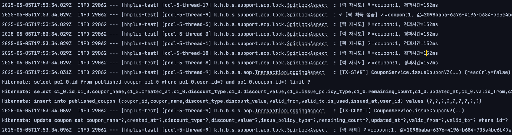  
모든 스레드가 동시에 락을 획득하는 시도를 하였고 9번 스레드가 락 획득에 성공했습니다. 그리고 나머지 스레드는 waitTime을 넘기 전까지  
락 획득을 재시도하게 됩니다. 락의 획득과 락의 해제는 트랜잭션 범위 밖에서 하게 되는 것을 로그를 통해 확인할 수 있습니다.

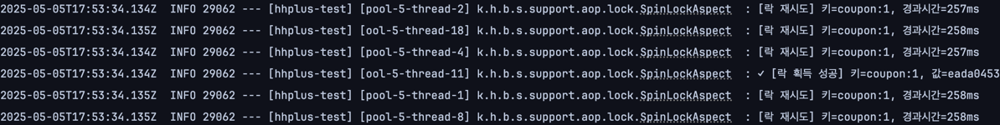

트랜잭션이 커밋되고 락이 해제되었다면 다시 다른 스레드가 락을 획득하는 것을 확인할 수 있고, 이를 통해 재시도 로직이 정상적으로 작동하는 것을 확인할 수 있습니다.

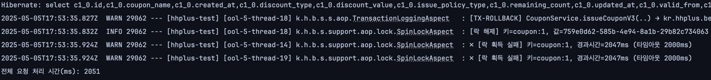

Spin Lock 구현 과정에서 dealine을 설정하여 락이 무한 대기하지 않게 설정했으므로 락 획득을 위한 대기 시간이 초과한 스레드는 락을 획득하지 못하고  
트랜잭션을 실행하지도 않습니다. 따라서 위 이미지의 로그에서 확인 가능한대로 락 획득에 실패한 스레드는 락 획득을 실패했다는 로그만 남기고 트랜잭션을 실행하지 않습니다.

### Redisson을 활용한 Pub/Sub 분산 락 구현 및 테스트

Redisson을 활용한 Pub/Sub Lock 구현은 Redisson의 RLock 인터페이스를 사용하여 락을 구현했습니다. Spin Lock과 동일하게  
어노테이션과 AOP를 활용하여 락을 구현했습니다.

```java

@Target(ElementType.METHOD)
@Retention(RetentionPolicy.RUNTIME)
public @interface DistributedLock {

	String key();

	// 락을 얻기까지 대기하는 시간을 waitTime이라 한다.
	long waitTime() default 5L;

	// 락을 획득한 후 락을 유지하는 시간을 leaseTime이라 한다.
	long leaseTime() default 8L;

	TimeUnit timeUnit() default TimeUnit.SECONDS;
}

@Aspect
@Component
@RequiredArgsConstructor
@Order(Ordered.HIGHEST_PRECEDENCE) // @Transactional보다 먼저 수행되어야 함을 의미한다.
@Slf4j
public class DistributedLockAspect {

	private static final String REDDISON_LOCK_KEY_PREFIX = "lock:";

	private final RedissonClient redissonClient;

	@Around("@annotation(kr.hhplus.be.server.support.aop.lock.DistributedLock)")
	public Object lock(ProceedingJoinPoint joinPoint) throws Throwable {
		MethodSignature signature = (MethodSignature)joinPoint.getSignature();
		Method method = signature.getMethod();
		DistributedLock distributedLock = method.getAnnotation(DistributedLock.class);

		// @DistributedLock(key = "#userId")와 같이 동적으로 key를 생성할 수 있다.
		String dynamicKey = CustomSpringELParser.getDynamicValue(
			signature.getParameterNames(),
			joinPoint.getArgs(),
			distributedLock.key());
		String lockKey = REDDISON_LOCK_KEY_PREFIX + dynamicKey;
		RLock lock = redissonClient.getLock(lockKey);

		boolean isLocked = false;
		try {
			isLocked = lock.tryLock(
				distributedLock.waitTime(),
				distributedLock.leaseTime(),
				distributedLock.timeUnit()
			);

			if (!isLocked) {
				log.warn("Lock 획득 실패: {}", lockKey);
				throw new IllegalStateException("현재 작업을 수행할 수 없습니다. 다른 작업이 진행 중입니다.");
			}

			log.info("Lock 획득 성공: {}", lockKey);
			return joinPoint.proceed();

		} catch (InterruptedException e) {
			log.error("Lock 대기 중 인터럽트 발생: {}", lockKey, e);
			Thread.currentThread().interrupt();
			throw e;
		} finally {
			if (isLocked && lock.isHeldByCurrentThread()) {
				lock.unlock();
				log.info("Lock 해제: {}", lockKey);
			}
		}
	}
}

@DistributedLock(key = "'coupon:' + #command.couponId")
@Transactional
public void issueCouponV4(CouponIssueCommand command) {
	if (couponRepository.existsPublishedCouponBy(command.userId(), command.couponId())) {
		throw new CouponAlreadyIssuedException();
	}

	Coupon coupon = couponRepository.findById(command.couponId());
	coupon.issue();

	Coupon savedCoupon = couponRepository.save(coupon);
	PublishedCoupon publishedCoupon = PublishedCoupon.create(command.userId(), savedCoupon, LocalDate.now());
	couponRepository.savePublishedCoupon(publishedCoupon);
}
```

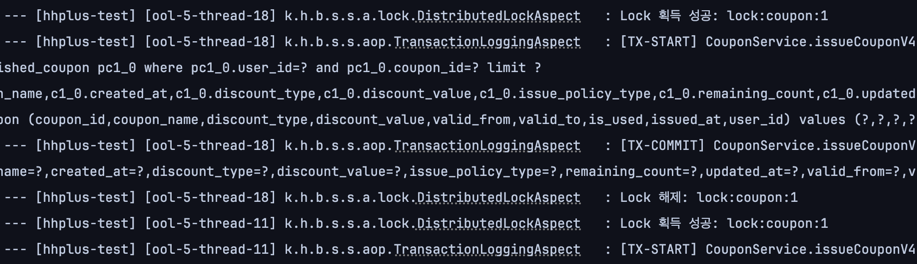

그림에서 볼 수 있듯이 아래와 같은 순서를 유지하는 것을 확인할 수 있습니다.

1. Lock 획득
2. 트랜잭션 시작
3. 비즈니스 로직 실행
4. 트랜잭션 커밋 혹은 롤백
5. Lock 해제
6. 다른 스레드가 Lock을 획득하고 비즈니스 로직을 실행

### Pub/Sub Lock과 Spin Lock의 성능 차이

두 가지 락을 높은 경합이 발생하는 선착순 쿠폰 발급 로직에 적용했을 시 성능을 비교했습니다. 조건은 아래와 같습니다.

- 조건
    - 사용자 수 (VUs) : 50
    - 발행 가능한 쿠폰 수 : 10개
    - 테스트 시간 : 1초

- 테스트 환경
    - 테스트 도구 : k6
    - 시스템 구성 : Redis 7.4.2(single), Spring Boot 3.4.1, Java 17, MySQL 8.0
    - 실행 환경 : MacBook Pro (Apple M3 Pro, 12-core CPU, 36GB RAM)
    - 테스트 도구: k6 v0.55.2 (go1.23.4, darwin/arm64)

그리고 이에 따른 테스트 결과는 아래와 같이 나타났습니다.

**Spin Lock 성능 표 (응답 시간 기준)**
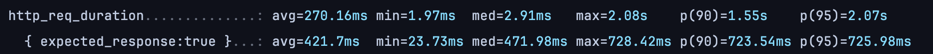

**Pub/Sub Lock 성능 표 (응답 시간 기준)**
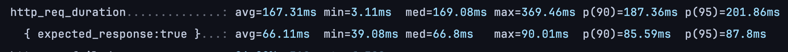

| 항목          | Spin Lock | Pub/Sub Lock  |
|-------------|-----------|---------------|
| 평균 응답 시간    | 270ms     | **167ms**     |
| 성공 응답 평균 시간 | 421ms     | **66ms**      |
| 최대 응답 시간    | 2.08초     | **369ms**     |
| 처리량 (RPS)   | 129.5 RPS | **276.4 RPS** |

결과 표에서 알 수 있듯, 높은 경합이 발생하는 시나리오에서는 Pub/Sub Lock이 Spin Lock에 비해 더 월등한 성능을 보였습니다.  
Spin Lock의 경우 모든 요청이 락을 획득하려고 반복 재시도를 수행하기 때문에 전체 응답 시간이 증가했습니다. 반면 Pub/Sub Lock은  
락 획득 실패 시 재시도 없이 대기 상태로 전환되므로 불필요한 트래픽이 줄어들고 응답이 빨라졌습니다.

성공 요청은 빠르게 락을 획득하고 응답을 반환하므로 평균 응답 시간과 최대 응답 시간이 모두 개선되었으며 전체적인 처리량 증가로 이어졌습니다.

### 결론

이커머스 프로젝트에서 높은 경합이 발생할 것으로 예상되는 재고 감소 혹은 선착순 쿠폰 발급과 같은 비즈니스 로직에는 Pub/Sub Lock을 적용하여  
동시성 제어와 성능 개선, DB 부하 감소를 동시에 달성할 수 있을 것으로 예상됩니다. 반면, 포인트 충전 및 사용처럼 높은 경합이 발생하지 않고    
재시도 횟수가 많지 않을 것으로 예상되는 시나리오에는 Spin Lock을 적용하는 것이 효과적입니다.

하지만 높은 경합이 발생할 것으로 예상되는 시나리오의 경우 Pub/Sub Lock을 적용하더라도 메세지가 치연 처리되거나 순서 보장의 문제는 여전히 남아있습니다.  
따라서 궁극적으로는 큐 기반의 비동기 처리 아키텍처로 나아가는 것을 고려해야 합니다.

## 배경 2: 레디스의 캐시 기능

항해 플러스 이커머스 프로젝트의 기능 중 인기 상품 조회 현재 DB에서 직접 조회하는 방식으로 구현되어 있습니다.
인기 상품 조회는 현재 일간, 주간, 월간의 기간 중에 가장 많이 팔린 상품을 조회하는 기능입니다. 각각의 기간은 다음과 같이 정의했습니다.

- 일간 : 어제 00:00부터 23:59까지
- 주간 : 오늘로부터 7일전 00:00부터 어제 23:59까지
- 월간 : 오늘로부터 30일전 00:00부터 어제 23:59까지

달력 기반으로 주간은 매주 월요일부터 오늘까지, 월간은 매달 1일부터 오늘까지로 설정하는 것을 고려하였으나 이러한 주별/월별 데이터의 경우  
해당 기간이 끝나야 완전한 데이터가 확보된다는 단점이 있고, 캐시 갱신, 최신 데이터 반영에 복잡도가 있어 채택하지 않았습니다.

이러한 인기 상품 조회는 이커머스 서비스의 특징상 사용자가 가장 많이 방문하는 페이지 중 하나이며 가장 많은 API 요청이 발생할 것으로 예상됩니다.  
따라서 DB에서 직접 조회하는 방식으로는 대규모 프로모션과 같은 이벤트에 의해 성능 저하가 발생할 수 있고 사용자의 구매 전환율에 높은 영향을 끼치는  
상품 탐색의 속도에 문제가 발생해 사용자 경험 감소와 같은 문제가 발생할 수 있습니다.

이러한 문제를 해결하기위해 Redis의 캐시 기능을 사용하여 인기 상품 조회 API의 성능 개선 작업을 수행했습니다.

## 인기 상품 캐시 전략 및 구현 과정

### 캐싱 전략 : 캐시에서만 데이터를 읽도록 한다.

앞서 언급한대로 인기 상품 API 요청은 DB의 읽기 연산 빈도가 가장 높을 것으로 예상되는 API입니다. 그러므로 DB에 요청을 보내지 않고  
캐시에서만 데이터를 읽도록 하는 것이 가장 이상적입니다. 따라서 아래와 같은 프로세스로만 동작해야 합니다.

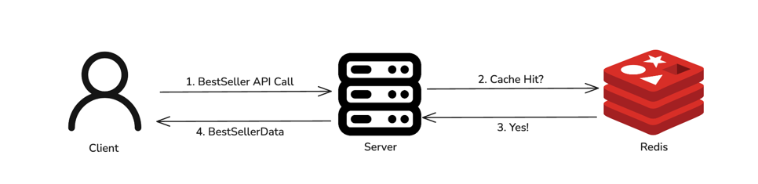

그리고 인기 상품 데이터를 항상 캐시에서 읽어 올 수 있도록 다음과 같은 스케줄러를 작성했습니다.  
캐시 만료 시간은 다음 날 00:30에 만료되도록 하였으며 캐시를 덮어쓰는 스케줄러가 동작하는 시간은 이보다 더 빠른 시간에 동작하도록 설정했습니다.

```java

@Component
@RequiredArgsConstructor
@Slf4j
public class BestSellerScheduler {

	@Scheduled(cron = "0 15 0 * * *")
	public void scheduleDailyCacheRefresh() {
		log.info("[스케줄러] 일간 베스트셀러 캐시 갱신 시작");
		bestSellerService.refreshDailyCache();
	}

	@Scheduled(cron = "0 15 0 * * *")
	public void scheduleWeeklyCacheRefresh() {
		log.info("[스케줄러] 주간 베스트셀러 캐시 갱신 시작");
		bestSellerService.refreshWeeklyCache();
	}

	@Scheduled(cron = "0 15 0 * * *", zone = "Asia/Seoul")
	public void scheduleMonthlyCacheRefresh() {
		log.info("[스케줄러] 월간 베스트셀러 캐시 갱신 시작");
		bestSellerService.refreshMonthlyCache();
	}
}

@Service
@RequiredArgsConstructor
@Slf4j
public class BestSellerService {

	private final BestSellerRepository bestSellerRepository;

	@CachePut(value = "bestSeller:daily", key = "'default'")
	public BestSellerResult refreshDailyCache() {
		LocalDateTime startOfYesterday = LocalDate.now().minusDays(1).atStartOfDay();
		LocalDateTime endOfYesterday = LocalDate.now().atStartOfDay().minusSeconds(1);

		return fetchBestSellers(startOfYesterday, endOfYesterday);
	}

	@CachePut(value = "bestSeller:weekly", key = "'default'")
	public List<BestSeller> refreshWeeklyCache() {
		LocalDateTime startOfLastWeek = LocalDate.now().minusDays(7).atStartOfDay();
		LocalDateTime endOfYesterday = LocalDate.now().atStartOfDay().minusSeconds(1);
		return bestSellerRepository.findTop100DateBetween(startOfLastWeek, endOfYesterday);
	}

	@CachePut(value = "bestSeller:monthly", key = "'default'")
	public List<BestSeller> refreshMonthlyCache() {
		LocalDateTime startOfLastMonth = LocalDate.now().minusDays(30).atStartOfDay();
		LocalDateTime endOfYesterday = LocalDate.now().atStartOfDay().minusSeconds(1);
		return bestSellerRepository.findTop100DateBetween(startOfLastMonth, endOfYesterday);
	}
}
```

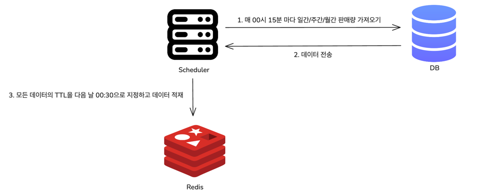

이와 같이 구현함으로써 별도의 캐시 만료 정책을 구현하지 않고 캐시를 갱신하여 인기 상품 조회 요청이 DB까지 가지 않도록 하였습니다.  
뿐만 아니라 하나의 캐시 항목이 만료되는 순간 다수의 요청이 데이터베이스에 쏠려 발생하는 캐시 스탬피드 문제를 피할 수 있었습니다.  
다만 캐시 스탬피드는 스케줄러가 정상 동작이 실패하는 경우에는 여전히 발생할 수 있습니다. 현 상황에서는 이 문제를 피하기 위해서  
캐시 TTL을 늘려 hotfix를 통해 대응할 수 있는 시간을 버는 것을 고려할 수 있습니다.

## 인기 상품 캐시 적용 전, 후 조회 성능 비교

캐시 적용 이후 실제로 부하 테스트 도구를 사용하여 캐시 적용 전후를 비교해보았습니다.

### 테스트 환경

- 테스트 도구 : k6
- 시스템 구성 : Redis 7.4.2(single), Spring Boot 3.4.1, Java 17, MySQL 8.0
- 실행 환경 : MacBook Pro (Apple M3 Pro, 12-core CPU, 36GB RAM)
- 테스트 도구: k6 v0.55.2 (go1.23.4, darwin/arm64)
- 데이터 : DB에 100만 건의 데이터가 존재하는 상태에서 테스트 진행.

### 테스트 스크립트

테스트에는 월간 인기 상품을 조회하도록 하였습니다.

```javascript
import http from 'k6/http';
import {sleep} from 'k6';

export const options = {
    stages: [
        {duration: '30s', target: 10},   // 초기 워밍업
        {duration: '30s', target: 50},   // 서서히 증가
        {duration: '30s', target: 100},  // 중간 강도
        {duration: '30s', target: 200},  // 높은 부하
        {duration: '30s', target: 500},  // 최대 부하
        {duration: '30s', target: 0},    // 완화
    ],
};

const BASE_URL = 'http://localhost:8080/api/v1/bestsellers';
const PERIOD = 'MONTHLY';

export default function () {
    const res = http.get(`${BASE_URL}?period=${PERIOD}`);
    console.log(`[${PERIOD}] Status: ${res.status} - Duration: ${res.timings.duration}ms`);

    sleep(0.5);
}
```

### 캐시 적용 전 부하 테스트 결과표

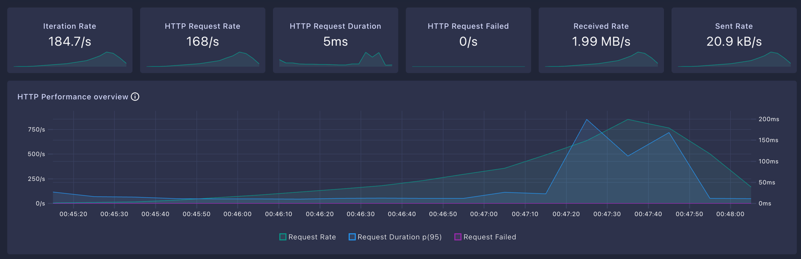
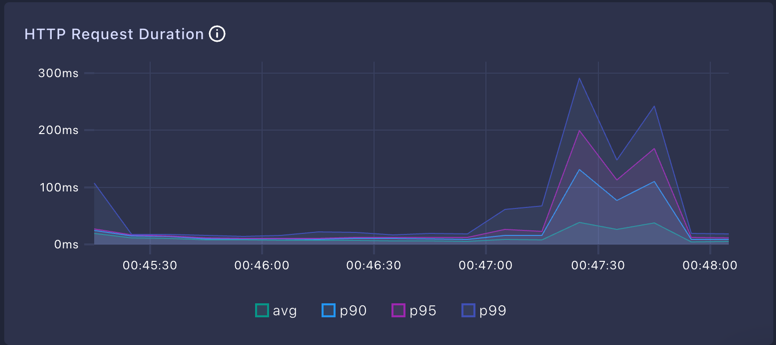

### 캐시 적용 후 부하 테스트 결과표

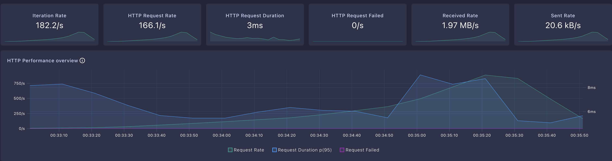
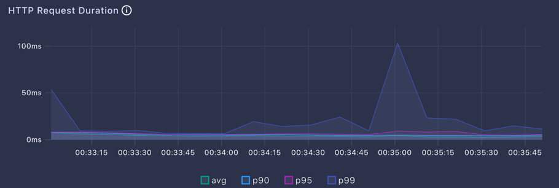

### 결과 해석

| **지표**                          | **캐시 미적용** | **캐시 적용**  | **비교**   |
|---------------------------------|------------|------------|----------|
| **HTTP Request Rate**           | 168/s      | 166.1/s    | -1.1% 감소 |
| **HTTP Request Duration (평균)**  | 5ms        | 3ms        | -40% 개선  |
| **HTTP Request Duration (P90)** | 200ms (최대) | 50ms (최대)  | -75% 개선  |
| **HTTP Request Duration (P95)** | 250ms (최대) | 50ms (최대)  | -80% 개선  |
| **HTTP Request Duration (P99)** | 300ms (최대) | 100ms (최대) | -66% 개선  |

캐시를 적용한 결과 요청 속도가 전반적으로 크게 개선되었습니다. 캐시 적용 전, 인덱스만 적용되어 있는 상황에서도  
평균 응답시간은 준수하였으나 부하가 커질수록 응답시간이 급격히 증가하는 것을 확인할 수 있었습니다. 캐시를 적용한 이후에는  
P90, P95, P99의 응답시간이 큰 폭으로 개선되었음을 확인할 수 있었습니다.

## 결론

인기 상품 조회 기능에 캐시를 적용함으로써 이전에 인덱스를 적용했던 것보다 더 높은 성능을 달성할 수 있었습니다.  
특히 부하가 점점 높아지는 상황에서도 캐시를 사용하지 않았을 때에 비해 100ms 이내로 응답 시간을 개선함으로써  
급격하게 트래픽이 몰리는 상황에서도 안정적인 성능을 유지할 수 있었습니다.

추후 적절한 캐시 추상화를 통해 중복 코드를 줄이고 운영을 하면서 지속적인 Cache Hit Ratio를 모니터링하여 캐시 성능을  
지속적으로 개선한다면 더욱 안정적인 서비스를 제공할 수 있을 것으로 기대됩니다. 또한 레디스 서버의 부하를 막기 위해  
애플리케이션 서버의 로컬 캐시를 두어 더 큰 부하에도 견딜 수 있는 구조를 고려하는 것도 좋은 방법이 될 것입니다.


